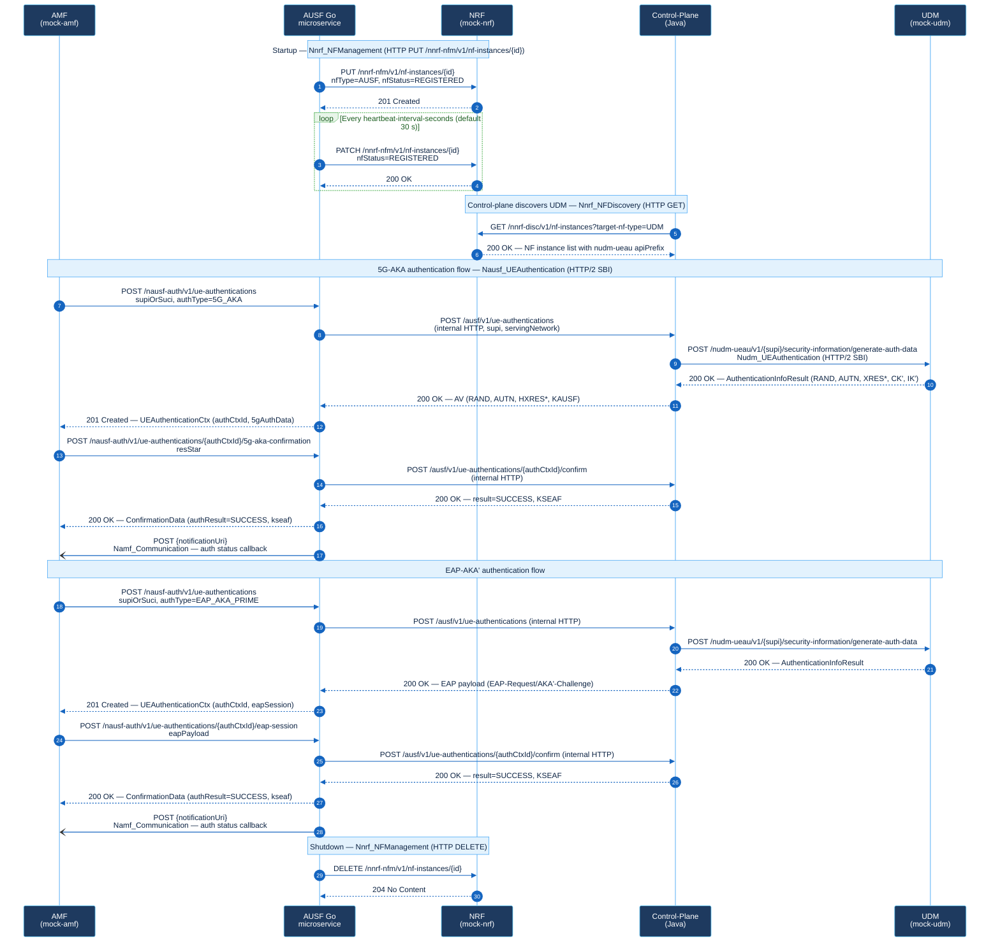

# AUSF 5G Core Polyglot Workspace

This repository contains a split-by-layer AUSF workspace for a 5G core implementation. The goal is to keep each concern in the language that best fits it:

| Layer | Main purpose | Language |
| --- | --- | --- |
| Networking / PFCP / low-level | Packet-oriented and transport-near code | C++ |
| Control plane logic | Authentication orchestration, UDM-facing vector generation, subscriber state | Java |
| Cloud / microservices | SBI-facing AUSF HTTP service | Go |
| Automation | Smoke tests, integration helpers, ops scripts | Python |

## Current scope

The project is a working foundation, not a complete production AUSF. It currently includes:

- C++ PFCP/networking sample with buildable CMake target.
- Java control-plane service with mock UDM/ARPF logic and file-backed subscriber storage.
- Go AUSF microservice exposing a concrete `nausf-auth` style API and delegating challenge/confirmation to Java.
- Auth context TTL expiration: contexts are automatically invalidated after a configurable number of seconds (`AUSF_AUTH_CONTEXT_TTL_SECONDS`). Expired contexts return `404 CONTEXT_NOT_FOUND`.
- Optional file-backed auth context persistence (`AUSF_AUTH_CONTEXT_STORE_FILE`): a running AUSF can reload its in-flight contexts after a restart, allowing confirmation to succeed even after a container restart.
- Python automation client and smoke-test helpers for the Go service contract, including context persistence and TTL scenarios.
- Root orchestration via `Makefile` and container startup via `docker-compose.yml`.
- Branch protection on `main` requires the `validate` CI check to pass before any PR can be merged.

## Implemented AUSF flow

Current layering is now explicit:

1. The external client talks to the Go SBI service.
2. The Go service creates an external `authCtxId` and delegates challenge/confirm operations to the Java control-plane.
3. The Java control-plane loads subscriber profiles from a file-backed store and simulates UDM/ARPF vector generation.
4. The Go service returns 3GPP-shaped DTOs, including `ProblemDetails` on errors.

The Go service exposes a simplified AUSF flow under `nausf-auth`:

1. `POST /nausf-auth/v1/ue-authentications`
2. `GET /nausf-auth/v1/ue-authentications/{authCtxId}`
3. `POST /nausf-auth/v1/ue-authentications/{authCtxId}/5g-aka-confirmation`
4. `POST /nausf-auth/v1/ue-authentications/{authCtxId}/eap-session`
5. `DELETE /nausf-auth/v1/ue-authentications/{authCtxId}`

### Protocol interaction diagram

The diagram below shows how the four runtime components interact and which protocol / interface is carried on each arrow.



Supported authentication modes:

- `5G_AKA`
- `EAP_AKA_PRIME`

Example create request:

```json
{
  "supiOrSuci": "imsi-250010000000001",
  "servingNetworkName": "5G:mnc001.mcc001.3gppnetwork.org",
  "authType": "5G_AKA",
  "notificationUri": "http://mock-amf:8092/namf-comm/v1/ue-authentications/{authCtxId}/status-notify"
}
```

Example `5G_AKA` response:

```json
{
  "authCtxId": "auth-1",
  "supi": "imsi-250010000000001",
  "servingNetworkName": "5G:mnc001.mcc001.3gppnetwork.org",
  "authType": "5G_AKA",
  "5gAuthData": {
    "rand": "...",
    "autn": "...",
    "hxresStar": "..."
  },
  "status": "CHALLENGE_SENT",
  "_links": {
    "5g-aka": {
      "href": "/nausf-auth/v1/ue-authentications/auth-1/5g-aka-confirmation"
    }
  },
  "createdAt": "2026-04-25T12:00:00Z"
}
```

Example `EAP_AKA_PRIME` response:

```json
{
  "authCtxId": "auth-2",
  "supi": "imsi-250010000000002",
  "servingNetworkName": "5G:mnc001.mcc001.3gppnetwork.org",
  "authType": "EAP_AKA_PRIME",
  "eapSession": {
    "method": "EAP-AKA'",
    "payload": "EAP-Request/AKA'-Challenge ...",
    "sessionId": "auth-2"
  },
  "_links": {
    "eap-session": {
      "href": "/nausf-auth/v1/ue-authentications/auth-2/eap-session"
    }
  },
  "status": "CHALLENGE_SENT"
}
```

Example `ProblemDetails` error:

```json
{
  "type": "https://example.com/problem/400",
  "title": "Invalid request",
  "status": 400,
  "detail": "supiOrSuci and servingNetworkName are required",
  "cause": "MANDATORY_IE_MISSING",
  "instance": "/nausf-auth/v1/ue-authentications"
}
```

## Operational contract

### Public endpoint contract

| Method and path | Success response | Failure responses |
| --- | --- | --- |
| `GET /healthz` | `200 OK`; body: `{"status":"ok"}` | No endpoint-specific `ProblemDetails` contract; failures are generic transport/runtime failures |
| `GET /metrics` | `200 OK`; body: Prometheus text exposition for AUSF HTTP request counters and latency summaries | No endpoint-specific `ProblemDetails` contract |
| `POST /nausf-auth/v1/ue-authentications` | `201 Created`; `Location` header set to `/nausf-auth/v1/ue-authentications/{authCtxId}`; body contains `authCtxId`, `supi`, `authType`, `status=CHALLENGE_SENT`, and either `5gAuthData` for `5G_AKA` or `eapSession` for `EAP_AKA_PRIME` | `400 MALFORMED_REQUEST`; `400 MANDATORY_IE_MISSING`; `400 INVALID_NOTIFICATION_URI`; `400 UNSUPPORTED_AUTH_TYPE`; `404 SUBSCRIBER_NOT_FOUND`; `502/503 CONTROL_PLANE_UNAVAILABLE`; `405 METHOD_NOT_ALLOWED` |
| `GET /nausf-auth/v1/ue-authentications/{authCtxId}` | `200 OK`; body contains the currently stored auth context for `authCtxId` | `404 CONTEXT_NOT_FOUND` |
| `POST /nausf-auth/v1/ue-authentications/{authCtxId}/5g-aka-confirmation` | `200 OK`; body contains `authCtxId`, `supi`, `authResult=SUCCESS`, `kseaf`, and confirmation `message` | `400 MALFORMED_REQUEST`; `400 INVALID_CONFIRMATION_PAYLOAD`; `404 CONTEXT_NOT_FOUND`; `401 AUTHENTICATION_REJECTED`; `502/503 CONTROL_PLANE_UNAVAILABLE` |
| `POST /nausf-auth/v1/ue-authentications/{authCtxId}/eap-session` | `200 OK`; body contains `authCtxId`, `supi`, `authResult=SUCCESS`, `kseaf`, and confirmation `message` | `400 MALFORMED_REQUEST`; `400 INVALID_CONFIRMATION_PAYLOAD`; `404 CONTEXT_NOT_FOUND`; `401 AUTHENTICATION_REJECTED`; `502/503 CONTROL_PLANE_UNAVAILABLE` |
| `DELETE /nausf-auth/v1/ue-authentications/{authCtxId}` | `204 No Content`; response body omitted | `404 CONTEXT_NOT_FOUND` |

Additional route behavior:

- Unknown AUSF sub-resources return `404 RESOURCE_UNKNOWN`.
- `ue-authentications` rejects malformed JSON with `400 MALFORMED_REQUEST`.
- `ue-authentications` accepts only `5G_AKA` and `EAP_AKA_PRIME` when `authType` is provided and rejects any other non-empty value with `400 UNSUPPORTED_AUTH_TYPE`.
- `5g-aka-confirmation` requires `resStar` and rejects `eapPayload` with `400 INVALID_CONFIRMATION_PAYLOAD`.
- `eap-session` requires `eapPayload` and rejects `resStar` with `400 INVALID_CONFIRMATION_PAYLOAD`.
- The current Java -> Go propagated failure causes are `SUBSCRIBER_NOT_FOUND`, `AUTHENTICATION_REJECTED`, `CONTEXT_NOT_FOUND`, and `CONTROL_PLANE_UNAVAILABLE`.
- All Go HTTP responses include `X-Trace-Id` and `traceparent` headers. Request logs include the same trace identifier in `trace_id=...` format.
- The Go control-plane HTTP client now uses a built-in circuit breaker: repeated transport/5xx failures open the breaker and subsequent calls fail fast with `503 CONTROL_PLANE_UNAVAILABLE` until the cooldown window elapses.

### Confirmed scenarios

| Scenario | Evidence | Confirmed result |
| --- | --- | --- |
| Base AUSF happy path on fresh compose startup | `python automation/scripts/smoke_test.py` | Service readiness, create challenge, and confirm success complete without an early `502` |
| `5G_AKA` happy path with Namf callback | `python automation/scripts/smoke_test_http_udm.py` | Challenge and confirmation succeed; Namf callback is emitted |
| `EAP_AKA_PRIME` happy path with Namf callback | `python automation/scripts/smoke_test_http_udm_eap.py` | EAP challenge and confirmation succeed; Namf callback is emitted |
| Invalid `notificationUri` negative path | `python automation/scripts/smoke_test_http_udm_invalid_notification_uri.py` | `400 INVALID_NOTIFICATION_URI`; no Namf callback |
| Unsupported `authType` negative path | `python automation/scripts/smoke_test_http_udm_unsupported_auth_type.py` | `400 UNSUPPORTED_AUTH_TYPE`; no Namf callback |
| Missing context negative path | `python automation/scripts/smoke_test_http_udm_missing_context.py` | `404 CONTEXT_NOT_FOUND`; no Namf callback |
| Missing subscriber negative path | `python automation/scripts/smoke_test_http_udm_missing_subscriber.py` | `404 SUBSCRIBER_NOT_FOUND`; no Namf callback |
| `5G_AKA` authentication rejection | `python automation/scripts/smoke_test_http_udm_authentication_rejected.py` | `401 AUTHENTICATION_REJECTED`; no Namf callback |
| `EAP_AKA_PRIME` authentication rejection | `python automation/scripts/smoke_test_http_udm_eap_authentication_rejected.py` | `401 AUTHENTICATION_REJECTED`; no Namf callback |
| Auth context survives Go service restart | `python automation/scripts/smoke_test_http_udm_context_survives_restart.py` | Challenge created, Go container restarted, confirmation succeeds using the file-backed context store |
| Auth context TTL expiration | `python automation/scripts/smoke_test_http_udm_context_ttl_expired.py` | Challenge created with short TTL, wait for expiry, confirmation returns `404 CONTEXT_NOT_FOUND` |
| Upstream UDM unavailable | `python automation/scripts/smoke_test_http_udm_upstream_unavailable.py` | Create request for `imsi-250010000000503` returns `502 CONTROL_PLANE_UNAVAILABLE` |

### Endpoint to validation matrix

| Method and path | Focused unit coverage | Compose smoke coverage |
| --- | --- | --- |
| `GET /healthz` | Python client tests cover the health client path | All smoke scripts gate on service health before continuing |
| `POST /nausf-auth/v1/ue-authentications` | Go HTTP tests cover malformed JSON, mandatory fields, invalid `notificationUri`, unsupported `authType`, subscriber-not-found propagation, and control-plane unavailability | Happy-path create is covered by `smoke_test.py`, `smoke_test_http_udm.py`, and `smoke_test_http_udm_eap.py`; negative create failures are covered by `smoke_test_http_udm_invalid_notification_uri.py`, `smoke_test_http_udm_unsupported_auth_type.py`, and `smoke_test_http_udm_missing_subscriber.py` |
| `GET /nausf-auth/v1/ue-authentications/{authCtxId}` | Go HTTP tests cover missing-context lookup and Go service tests cover in-memory lookup lifecycle | Context retrieval is exercised during the happy-path smoke flow before confirmation |
| `POST /nausf-auth/v1/ue-authentications/{authCtxId}/5g-aka-confirmation` | Go HTTP tests cover invalid payload, missing context, authentication rejection, and propagated control-plane not-found handling | Happy-path confirmation is covered by `smoke_test.py` and `smoke_test_http_udm.py`; negative confirmation is covered by `smoke_test_http_udm_missing_context.py` and `smoke_test_http_udm_authentication_rejected.py` |
| `POST /nausf-auth/v1/ue-authentications/{authCtxId}/eap-session` | Go HTTP tests cover invalid payload routing and Go service tests cover explicit `EAP_AKA_PRIME` context initialization | Happy-path EAP confirmation is covered by `smoke_test_http_udm_eap.py`; negative EAP rejection is covered by `smoke_test_http_udm_eap_authentication_rejected.py` |
| `DELETE /nausf-auth/v1/ue-authentications/{authCtxId}` | Go HTTP tests cover missing-context delete and Go service tests cover delete-after-delete lifecycle behavior | Negative delete-after-missing-context is covered indirectly by the missing-context smoke flow cleanup path |

### Supporting validation

- `python -m unittest discover -s automation/tests` confirms Python client and helper behavior.
- `go test ./internal/api ./internal/controlplane ./internal/namf ./internal/service` confirms the focused Go service, API, and control-plane adapter slices.
- `mvn -q -Dtest=AuthenticationManagerTest,AuthenticationControllerTest,NnrfClientTest,HttpUdmClientTest test` confirms the focused Java control-plane slices.
- `pwsh -File automation/scripts/run_pre_push_regression.ps1` is the current one-command reproducible pre-push run.
- `.github/workflows/regression-suite.yml` runs the same validation flow on `push` and `pull_request` in GitHub Actions.

Important note:

- The crypto is intentionally simplified for development. It is not a standards-compliant Milenage or TUAK implementation.
- `RAND`, `AUTN`, `RES*`, `HXRES*`, `KSEAF`, and EAP payloads are modeled to support flow development and API integration, not production-grade security.

## Project structure

```text
AUSF/
├── automation/
│   ├── requirements.txt
│   ├── scripts/
│   │   ├── smoke_test.py
│   │   ├── smoke_test_http_udm.py
│   │   ├── smoke_test_http_udm_eap.py
│   │   ├── smoke_test_http_udm_invalid_notification_uri.py
│   │   ├── smoke_test_http_udm_missing_context.py
│   │   ├── smoke_test_http_udm_missing_subscriber.py
│   │   ├── smoke_test_http_udm_authentication_rejected.py
│   │   ├── smoke_test_http_udm_eap_authentication_rejected.py
│   │   ├── smoke_test_http_udm_context_survives_restart.py
│   │   ├── smoke_test_http_udm_context_ttl_expired.py
│   │   ├── smoke_test_http_udm_upstream_unavailable.py
│   │   ├── run_http_udm_smoke_suite.py
│   │   ├── run_full_validation.py
│   │   ├── run_ttl_smoke_only.py
│   │   ├── run_fast_validation.ps1
│   │   ├── run_pre_push_regression.ps1
│   │   └── refresh_mock_services.ps1
│   ├── src/
│   │   ├── compose_runtime.py
│   │   ├── smoke_client.py
│   │   └── smoke_runtime.py
│   └── tests/
│       └── test_smoke_client.py
├── control-plane/
│   ├── data/
│   │   └── subscribers.json
│   ├── Dockerfile
│   ├── pom.xml
│   └── src/
│       ├── main/
│       │   ├── java/com/ausf/controlplane/
│       │   │   ├── ControlPlaneApplication.java
│       │   │   ├── api/
│       │   │   │   └── AuthenticationController.java
│       │   │   ├── authentication/
│       │   │   │   ├── AuthenticationContext.java
│       │   │   │   ├── AuthenticationManager.java
│       │   │   │   ├── AuthenticationRequest.java
│       │   │   │   ├── AuthenticationResponse.java
│       │   │   │   └── CryptographyService.java
│       │   │   ├── subscriber/
│       │   │   │   ├── FileSubscriberRepository.java
│       │   │   │   ├── SubscriberProfile.java
│       │   │   │   └── SubscriberRepository.java
│       │   │   └── udm/
│       │   │       ├── AuthenticationVector.java
│       │   │       └── UdmService.java
│       │   └── resources/
│       │       ├── application.properties
│       │       └── seed/
│       │           └── subscribers.json
│       └── test/
│           └── java/com/ausf/controlplane/authentication/
│               └── AuthenticationManagerTest.java
├── microservices/
│   ├── Dockerfile
│   ├── cmd/
│   │   └── ausf/
│   │       └── main.go
│   ├── go.mod
│   └── internal/
│       ├── api/
│       │   ├── http_handler.go
│       │   └── problem_details.go
│       ├── config/
│       │   └── config.go
│       ├── controlplane/
│       │   └── client.go
│       └── service/
│           ├── auth_context_store.go
│           └── auth_service.go
├── networking/
│   ├── CMakeLists.txt
│   ├── Makefile
│   ├── include/
│   │   └── pfcp_handler.h
│   └── src/
│       ├── main.cpp
│       └── pfcp_handler.cpp
├── mock-network-functions/
│   ├── nrf_server.py
│   └── udm_server.py
├── docker-compose.yml
├── Makefile
└── README.md
```

## How the layers fit together

- `networking/` is the place for PFCP or other transport-near protocol work.
- `control-plane/` owns subscriber lookup, authentication vectors, EAP/AKA branching, and internal auth context state.
- `microservices/` is the northbound AUSF SBI surface and now acts as an adapter over the Java control-plane.
- `automation/` is the place for smoke tests, API validation, CI helpers, and deployment scripts.

The control-plane now supports a pluggable UDM southbound integration mode:

- `mock` mode uses the local file-backed subscriber store and development vector generation.
- `http` mode calls an external UDM-style endpoint and expects pre-generated authentication data.

For southbound integration testing, the repository also provides lightweight mock network functions:

- `mock-udm` exposes a development `Nudm_UEAuthentication`-style HTTP endpoint.
- `mock-nrf` exposes a development `Nnrf_NFDiscovery`-style HTTP endpoint that returns the `mock-udm` location.

## Local development

### C++ networking layer

```bash
cmake -S networking -B networking/build
cmake --build networking/build
./networking/build/Debug/networking_test.exe
```

### Java control plane

```bash
cd control-plane
mvn test
mvn spring-boot:run
```

Internal Java endpoints:

- `POST /control-plane/v1/auth/initiate`
- `POST /control-plane/v1/auth/{supi}/confirm`
- `GET /control-plane/v1/auth/{supi}`

### Go microservice

```bash
cd microservices
set CONTROL_PLANE_BASE_URL=http://127.0.0.1:8081
go build ./...
go run ./cmd/ausf
```

### Python automation

```bash
cd automation
python -m unittest discover -s tests
python scripts/smoke_test.py
python scripts/smoke_test_http_udm.py
python scripts/smoke_test_http_udm_eap.py
python scripts/smoke_test_http_udm_invalid_notification_uri.py
python scripts/smoke_test_http_udm_missing_context.py
python scripts/smoke_test_http_udm_missing_subscriber.py
python scripts/smoke_test_http_udm_authentication_rejected.py
python scripts/smoke_test_http_udm_eap_authentication_rejected.py
python scripts/smoke_test_http_udm_context_survives_restart.py
python scripts/smoke_test_http_udm_context_ttl_expired.py
python scripts/smoke_test_http_udm_upstream_unavailable.py
python scripts/run_http_udm_smoke_suite.py
python scripts/run_full_validation.py
pwsh -File scripts/run_fast_validation.ps1
pwsh -File scripts/run_pre_push_regression.ps1
```

From the repository root, the shortest one-command validation entrypoint is:

```bash
make validate-fast
```

`make validate-fast` is the canonical make entrypoint for local validation. On Windows, that target delegates to the PowerShell wrapper `automation/scripts/run_fast_validation.ps1`, so the same fast runner is used by both `make validate-fast` and direct PowerShell execution. The shared runner then executes the optimized full validation workflow in `automation/scripts/run_full_validation.py`. When host Maven is available, it reuses the fast path that packages the Java runtime JAR on the host, prebuilds the `ausf-control-plane` and `ausf-go` runtime images, and then runs the HTTP UDM smoke suite with `--skip-build`.

On Windows hosts where `make` is not available in `PATH`, use:

```powershell
pwsh -File automation/scripts/run_fast_validation.ps1
```

If you only need to rerun the compose-backed smoke suite after those images are already prepared, use:

```bash
python automation/scripts/run_http_udm_smoke_suite.py --skip-build
```

If you only need the TTL-expiration verification (without the rest of the smoke matrix), use:

```bash
make smoke-ttl-only
```

`make smoke-ttl-only` rebuilds `ausf-go`, starts compose without extra rebuilds, runs `automation/scripts/smoke_test_http_udm_context_ttl_expired.py`, and then tears the stack down.

`make validate-all` remains available as a backward-compatible alias for the same full workflow.

The HTTP UDM smoke coverage is split by auth mode:

- `python automation/scripts/smoke_test.py` validates the base AUSF happy path against a freshly started compose stack and now waits for service readiness before initiating authentication.
- `python automation/scripts/smoke_test_http_udm.py` validates the `5G_AKA` flow and Namf callback path.
- `python automation/scripts/smoke_test_http_udm_eap.py` validates the `EAP_AKA_PRIME` flow through the dedicated `eap-session` confirmation subresource and the same Namf callback path.
- `python automation/scripts/smoke_test_http_udm_invalid_notification_uri.py` validates the negative create path, asserting `400` with `cause=INVALID_NOTIFICATION_URI` and no Namf callback for a relative `notificationUri`.
- `python automation/scripts/smoke_test_http_udm_missing_context.py` validates the negative confirm path, asserting `404` with `cause=CONTEXT_NOT_FOUND` and no Namf callback for a missing `authCtxId`.
- `python automation/scripts/smoke_test_http_udm_missing_subscriber.py` validates the negative initiate path, asserting `404` with `cause=SUBSCRIBER_NOT_FOUND` and no Namf callback for an unknown SUPI.
- `python automation/scripts/smoke_test_http_udm_authentication_rejected.py` validates the negative confirm path, asserting `401` with `cause=AUTHENTICATION_REJECTED` and no Namf callback for an invalid `resStar`.
- `python automation/scripts/smoke_test_http_udm_eap_authentication_rejected.py` validates the negative EAP confirm path, asserting `401` with `cause=AUTHENTICATION_REJECTED` and no Namf callback for an invalid `eapPayload`.

## Root orchestration

The root `Makefile` provides a single entry point for common actions:

```bash
make networking-build
make control-plane-test
make microservices-build
make automation-test
make http-udm-smoke-suite
make validate-all
make regression-suite
make compose-up
make compose-refresh-mocks
```

If you work on Windows without `make`, use Git Bash, MSYS2, WSL, or run the equivalent commands manually.

For the bind-mounted Python mock services, a plain `docker compose up -d` does not restart an already running container, so code changes in `mock-amf` or `mock-nrf` may not be picked up immediately. Use `make compose-refresh-mocks` or run `pwsh -File automation/scripts/refresh_mock_services.ps1` to force a clean stop/remove/recreate cycle for those two services.

To run the full HTTP UDM happy/negative validation set in one shot, use `make http-udm-smoke-suite` or `python automation/scripts/run_http_udm_smoke_suite.py`. The suite brings the compose stack up, runs three happy-path smoke scenarios (`smoke_test.py`, `smoke_test_http_udm.py`, `smoke_test_http_udm_eap.py`), then the negative HTTP UDM scenarios, and always tears the stack down at the end.

To run the current minimal reproducible pre-push regression suite in one shot, use `make regression-suite`, `make validate-all`, `python automation/scripts/run_full_validation.py`, or `pwsh -File automation/scripts/run_pre_push_regression.ps1`. This wrapper runs Python unit tests, focused Go tests in the pinned Go devcontainer image, focused Java tests in the pinned Java 25 devcontainer image, and then the full HTTP UDM happy/negative smoke suite.

## Docker Compose

The repository includes `docker-compose.yml` for the Go AUSF service and Java control-plane service.

Start the stack:

```bash
docker compose up --build
```

Services:

- Go AUSF service: `http://localhost:8080`
- Java control-plane service: `http://localhost:8081`
- Mock UDM service: `http://localhost:8090`
- Mock NRF service: `http://localhost:8091`
- Mock AMF service: `http://localhost:8092`

Important runtime variables:

- `CONTROL_PLANE_BASE_URL` tells Go where the Java control-plane lives.
- `AUSF_SUBSCRIBER_STORE` tells Java where the persistent subscriber JSON file lives.
- `AUSF_UDM_MODE` selects the UDM integration mode: `mock` or `http`.
- `AUSF_UDM_BASE_URL` points the control-plane directly at an external UDM when `AUSF_UDM_MODE=http`.
- `AUSF_NNRF_BASE_URL` points the control-plane at an external NRF discovery service when the UDM location should be resolved dynamically.
- `AUSF_NAMF_BASE_URL` points the Go AUSF service at an AMF-facing status notification endpoint.
- `AUSF_AUTH_CONTEXT_STORE_FILE` (optional) sets the path to a JSON file where the Go AUSF service persists in-flight auth contexts. When set, contexts survive a container restart. When unset, contexts are stored in-memory only.
- `AUSF_AUTH_CONTEXT_TTL_SECONDS` (optional, default unlimited) sets the TTL in seconds for auth contexts. Contexts older than this value are treated as expired and return `404 CONTEXT_NOT_FOUND`.
- `AUSF_CONTROL_PLANE_BREAKER_FAILURES` (optional, default `5`) sets how many consecutive transport/5xx failures are required to open the Go control-plane circuit breaker.
- `AUSF_CONTROL_PLANE_BREAKER_TIMEOUT_SECONDS` (optional, default `10`) sets how long the breaker stays open before it allows calls again.

Observability endpoints and headers:

- `GET /metrics` returns Prometheus-compatible metrics for request counts and latency.
- `X-Trace-Id` is returned on every Go API response.
- `traceparent` is returned on every Go API response and accepted on incoming requests.

When `notificationUri` is provided on the create request, the Go AUSF service uses that per-session callback template in preference to the global `AUSF_NAMF_BASE_URL`. The `{authCtxId}` placeholder is replaced with the generated authentication context identifier before the Namf callback is sent.

When `AUSF_NNRF_BASE_URL` is set and `AUSF_UDM_BASE_URL` is empty, the control-plane first calls:

- `GET /nnrf-disc/v1/nf-instances?target-nf-type=UDM&requester-nf-type=AUSF`

Expected NRF response body:

```json
{
  "nfInstances": [
    {
      "services": [
        {
          "serviceName": "nudm-ueau",
          "apiPrefix": "http://mock-udm:8090"
        }
      ]
    }
  ]
}
```

When `AUSF_UDM_MODE=http`, the control-plane calls:

- `POST /nudm-ueau/v1/{supi}/security-information/generate-auth-data`

Expected request body:

```json
{
  "servingNetworkName": "5G:mnc001.mcc001.3gppnetwork.org",
  "authType": "5G_AKA"
}
```

When `AUSF_NAMF_BASE_URL` is set, the Go AUSF service sends a southbound notification after successful confirmation:

- `POST /namf-comm/v1/ue-authentications/{authCtxId}/status-notify`

Expected request body:

```json
{
  "authCtxId": "auth-1",
  "supi": "imsi-250010000000001",
  "authType": "5G_AKA",
  "servingNetworkName": "5G:mnc001.mcc001.3gppnetwork.org",
  "authResult": "SUCCESS",
  "kseaf": "..."
}
```

Expected response body:

```json
{
  "supi": "imsi-250010000000001",
  "authType": "5G_AKA",
  "servingNetworkName": "5G:mnc001.mcc001.3gppnetwork.org",
  "rand": "...",
  "autn": "...",
  "xresStar": "...",
  "hxresStar": "...",
  "kausf": "...",
  "eapChallenge": null
}
```

## Known limitations

This workspace is intentionally a development foundation. The following limitations are currently known and accepted:

- Real 3GPP-compliant Milenage or TUAK algorithms.
- Real Nnrf / Namf interactions.
- Production-grade Nudm interoperability beyond the current pluggable mock/http development contract.
- Durable database-backed storage instead of JSON file storage.
- Production-grade security, TLS, OAuth2, and SBI authorization.
- Full 5G AKA and EAP-AKA' state machines.
- Real PFCP data plane integration.
- Circuit breaking and tracing between Go and Java services.

## Validation coverage

Operational scenarios are listed in the `Operational contract` section above. Additional coverage confirmed in the current environment:

- C++ networking layer builds and its sample executable runs.
- Focused Go tests pass in a containerized Go toolchain, including `./internal/api`, `./internal/controlplane`, `./internal/namf`, and `./internal/service`.
- Focused Java tests pass in a containerized Java/Maven toolchain, including `AuthenticationManagerTest`, `AuthenticationControllerTest`, `NnrfClientTest`, and `HttpUdmClientTest`.
- Python automation unit tests pass.
- IDE diagnostics for the edited Go and Java sources are clean.
- Docker Compose stack with `mock-nrf`, `mock-udm`, and `mock-amf` starts successfully.
- Auth context TTL expiration smoke validated end-to-end: context created, TTL elapsed, confirmation returns `404 CONTEXT_NOT_FOUND`.
- Auth context file-backed persistence smoke validated: context survives a Go container restart, confirmation succeeds after restart.
- Upstream-unavailable smoke validated: `imsi-250010000000503` triggers `502 CONTROL_PLANE_UNAVAILABLE` via `MOCK_UDM_UNAVAILABLE_SUPIS`.
- `python automation/scripts/run_http_udm_smoke_suite.py` runs the full HTTP UDM happy/negative smoke suite and cleans the compose stack up afterward.
- `python automation/scripts/run_full_validation.py` runs the current CI-friendly validation stack end-to-end: Python unit tests, focused Go tests, focused Java tests, and the HTTP UDM smoke suite.
- `pwsh -File automation/scripts/run_pre_push_regression.ps1` runs the same suite through the Windows-oriented helper wrapper.
- `.github/workflows/regression-suite.yml` enforces the same `validate` job on every `push` and `pull_request`. The `main` branch is protected: merging requires one approved review, resolved conversations, and a passing `validate` status check.

Not fully validated in the current environment:

- Full end-to-end validation of every branch and failure mode has not been run.
- Host-native `go` and `mvn` commands were not used directly; validation was performed through containerized toolchains.

## Roadmap

The backlog below is ordered by priority. Items are grouped into three horizons.

### Horizon 1 — correctness and production-readiness (next sprint)

| # | Item | Layer | Why |
|---|------|-------|-----|
| 1 | Replace development crypto with real Milenage/TUAK | Java control-plane | Current RAND/AUTN/RES\* generation is not standards-compliant; needed before any interop testing |
| 2 | Replace JSON file storage with a persistent database (e.g. PostgreSQL or embedded H2) | Java control-plane | File-backed subscriber store does not survive concurrent writes or horizontal scale-out |
| 3 | Add TLS between services and toward external NFs | Go + Java | Required by 3GPP SBI specifications; currently all traffic is plain HTTP |
| 4 | Add OAuth2/token-based SBI authorization | Go microservice | 3GPP TS 33.501 mandates NF-level authorization on SBI interfaces |
| 5 | Implement full 5G AKA state machine (including SYNC\_FAILURE and re-sync) | Go + Java | Current flow only covers the happy path and simple rejection; missing AUTN failure handling |
| 6 | Implement full EAP-AKA' state machine (EAP-Failure, re-auth, fast re-auth) | Go + Java | Current EAP flow only covers the initial challenge/response exchange |

### Horizon 2 — resilience and observability (following sprint)

| # | Item | Layer | Why |
|---|------|-------|-----|
| 7 | Add circuit breaker between Go↔Java and Java↔UDM | Go + Java | ✅ Go↔Java implemented; ✅ Java↔UDM `UdmCircuitBreaker` implemented (configurable via `AUSF_UDM_BREAKER_FAILURES` / `AUSF_UDM_BREAKER_OPEN_SECONDS`) |
| 8 | ✅ Add distributed tracing (OpenTelemetry) | Go + Java | Correlate requests across the three-service boundary for debugging and SLA monitoring |
| 9 | ~~Expand `/metrics` coverage~~ | Go microservice | ✅ Implemented: `ausf_auth_initiated_total`, `ausf_auth_confirmed_total`, `ausf_auth_failed_total` by auth type/cause alongside HTTP metrics |
| 10 | ~~Add structured JSON logging with trace-ID propagation~~ | Go microservice | ✅ Implemented: all log lines are machine-parseable JSON `{"time","level","trace_id","msg",...}` |
| 11 | ~~Harden auth context TTL: persist TTL metadata across restarts~~ | Go microservice | ✅ Implemented: `CreatedAt` is persisted in the JSON file store; zero-timestamp legacy contexts are treated as expired when TTL is enabled |

### Horizon 3 — integration and deployment

| # | Item | Layer | Why |
|---|------|-------|-----|
| 12 | ~~Production-grade NRF integration: heartbeat registration, NF profile, subscription-based UDM discovery~~ | Java control-plane | ✅ Implemented: `NrfLifecycleManager` registers on startup via `PUT /nnrf-nfm/v1/nf-instances/{id}`, sends periodic heartbeats (`PATCH`), and deregisters on shutdown (`DELETE`). Configurable via `AUSF_NNRF_NF_INSTANCE_ID`, `AUSF_NNRF_HEARTBEAT_INTERVAL` (default 30 s) |
| 13 | Production-grade Nudm interoperability (full `Nudm_UEAuthentication` contract) | Java control-plane | Current mock UDM contract is simplified; real UDM response shapes differ |
| 14 | Real PFCP data plane integration in the C++ networking layer | C++ | Current PFCP code is a stub; connecting it to the authentication result flow closes the user-plane loop |
| 15 | ~~Kubernetes/Helm deployment manifests with readiness/liveness probes~~ | Infrastructure | ✅ Implemented: Helm chart at `deploy/helm/ausf/` — Go microservice + Java control-plane Deployments/Services, optional mock NFs (`mocks.enabled`), PVC for auth-context store, liveness/readiness probes, non-root security contexts |
| 16 | Load and soak testing with realistic SUPI populations | Automation | Verify throughput, TTL under concurrent load, and file-store write performance |
| 17 | Devcontainer-based one-click local setup | Infrastructure | Remove dependency on pre-installed Docker/Maven/Go versions on developer machines |
