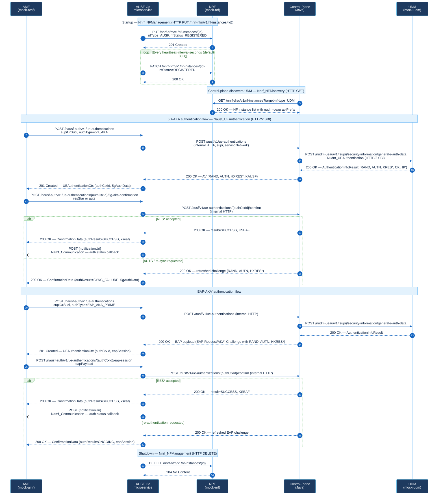

# AUSF 5G Core — Многоязычное рабочее пространство

Репозиторий содержит рабочее пространство AUSF, разделённое по уровням реализации для 5G-ядра. Цель — держать каждую задачу в языке, наиболее для неё подходящем:

| Уровень | Основная задача | Язык |
| --- | --- | --- |
| Сетевой / PFCP / низкоуровневый | Пакетно-ориентированный и транспортно-близкий код | C++ |
| Логика управляющего уровня | Оркестрация аутентификации, генерация векторов на стороне UDM, состояние абонента | Java |
| Облако / микросервисы | HTTP-сервис AUSF, обращённый к SBI | Go |
| Автоматизация | Дымовые тесты, интеграционные вспомогательные средства, операционные скрипты | Python |

## Быстрый старт

**Требования:** Docker Desktop (compose v2), Python 3.10+, Go 1.22+, Java 21+, Maven.

### 1. Запустить весь стек одной командой

```bash
cd AUSF
docker compose up --build
```

После старта сервисы доступны по адресам:

| Сервис | URL |
|--------|-----|
| AUSF Go (SBI) | <http://localhost:8080> |
| Control-plane Java | <http://localhost:8081> |
| Mock UDM | <http://localhost:8090> |
| Mock NRF | <http://localhost:8091> |
| Mock AMF | <http://localhost:8092> |

Проверить работоспособность:

```bash
curl http://localhost:8080/healthz
# {"status":"ok"}
```

### 2. Запустить базовый happy-path smoke-тест

```bash
# Установить зависимости Python один раз
pip install -r automation/requirements.txt

# Запустить smoke-тест 5G-AKA (требует работающего стека)
python automation/scripts/smoke_test_http_udm.py
```

### 3. Запустить полный smoke-набор

Поднимает стек, прогоняет все happy-path и негативные сценарии, останавливает стек:

```bash
python automation/scripts/run_http_udm_smoke_suite.py
```

На Windows без `make`:

```powershell
pwsh -File automation/scripts/run_fast_validation.ps1
```

### 4. Полная валидация (unit-тесты + smoke + TLS + Redis-failover)

```bash
python automation/scripts/run_full_validation.py
```

Или через Makefile:

```bash
make validate-fast        # быстрый прогон (рекомендуется перед push)
make validate-all         # полная валидация
```

### 5. Запустить только unit-тесты

```bash
# Go
cd microservices && go test ./...

# Java
cd control-plane && mvn -q test

# Python
cd automation && python -m unittest discover -s tests
```

### 6. Запустить chaos/resilience тесты (Горизонт 10)

```bash
# Circuit-breaker: убить control-plane, убедиться, что AUSF возвращает 503,
# перезапустить, убедиться что breaker сбрасывается и auth проходит
python automation/scripts/smoke_test_chaos_control_plane_down.py

# Redis-failover: стек с Redis-очередью, остановить Redis mid-flight,
# убедиться, что AUSF не падает и auth возвращает SUCCESS
python automation/scripts/smoke_test_redis_failover.py

# 20 параллельных аутентификаций без data-race и перепутанных xresStar
python automation/scripts/smoke_test_concurrent_auth.py
```

---

## Скрипты автоматизации

Все скрипты находятся в `automation/scripts/` и делятся на три категории.

### Оркестраторы — запускать самостоятельно

| Скрипт | Что делает |
|--------|-----------|
| `run_http_udm_smoke_suite.py` | Поднимает стек, прогоняет ~83 smoke-теста (happy-path, негативные, concurrent), останавливает стек. **Основной сценарий для CI и ручной проверки.** |
| `run_full_validation.py` | Полная валидация: unit-тесты Go + Java + Python, HTTP UDM smoke, TLS smoke, SIGHUP, Flyway, Redis-failover. |
| `run_https_tls_smoke_suite.py` | TLS smoke-суита (требует TLS-сертификатов из `generate_dev_tls_assets.py`). |
| `run_ttl_smoke_only.py` | Только TTL-тест — быстрая точечная проверка TTL-экспирации. |
| `run_fast_validation.ps1` | PowerShell-обёртка быстрой валидации (без Docker-сборки). |
| `run_pre_push_regression.ps1` | Регрессионный прогон перед `git push`. |

### Самостоятельные smoke-тесты — запускать при поднятом стеке

Эти скрипты подключаются к `127.0.0.1:8080–8092` (или к адресам из переменных окружения). Стек должен быть запущен заранее (`docker compose up --build -d`).

| Скрипт | Сценарий |
|--------|---------|
| `smoke_test_http_udm.py` | Happy-path 5G-AKA с Namf-нотификацией |
| `smoke_test_http_udm_eap.py` | Happy-path EAP-AKA' |
| `smoke_test_concurrent_auth.py` | 20 параллельных 5G-AKA аутентификаций |
| `smoke_test_chaos_control_plane_down.py` | Circuit-breaker: убить control-plane, проверить 502/503, поднять, убедиться что breaker сбрасывается |
| `smoke_test_namf_retry_queue.py` | Retry-очередь Namf: уведомление доставляется после перезапуска mock-AMF |
| `smoke_test_redis_failover.py` | Redis-failover: AUSF не падает при недоступном Redis |
| `smoke_test_sighup_cert_reload.py` | SIGHUP: горячая перезагрузка TLS-сертификатов без перезапуска |
| `smoke_test_flyway_migration.py` | Flyway: миграция схемы БД при старте |
| `smoke_test_http_udm_context_survives_restart.py` | Контекст аутентификации переживает перезапуск контейнера |
| `smoke_test_http_udm_context_ttl_expired.py` | Истёкший контекст возвращает 404 CONTEXT_NOT_FOUND |
| `smoke_test.py` | Базовый happy-path (упрощённый вариант) |
| `smoke_test_https_tls.py` / `smoke_test_https_tls_eap.py` | Happy-path через TLS |

Отдельные `smoke_test_http_udm_*.py` (негативные и edge-case сценарии) также работают при поднятом стеке, но обычно их запускают через оркестратор `run_http_udm_smoke_suite.py`.

### Вспомогательные скрипты — не запускать напрямую

| Скрипт | Назначение |
|--------|-----------|
| `smoke_test_http_udm_context_survives_restart_prepare.py` / `_verify.py` | Вызываются изнутри `_context_survives_restart.py` |
| `smoke_test_http_udm_context_ttl_expired_prepare.py` / `_verify.py` | Вызываются изнутри `_context_ttl_expired.py` |
| `smoke_test_http_udm_warmup.py` | Разогрев перед суитой (вызывается оркестратором) |
| `generate_dev_tls_assets.py` | Генерация TLS-сертификатов для dev-окружения |
| `refresh_mock_services.ps1` | Пересборка mock-сервисов |
| `run_load_test.py` | Нагрузочный тест (отдельный сценарий, не входит в CI) |
| `sync_github_labels.ps1` | Синхронизация меток GitHub (`-Repository owner/repo`) |

---

## Текущий охват

Проект является работающей основой, а не полноценным AUSF для производственного использования. В настоящее время включает:

- Пример C++ PFCP/сети с собираемым CMake-таргетом.
- Сервис управляющего уровня на Java с оркестрацией через макет UDM/ARPF, генерацией векторов аутентификации на основе стандартов Milenage/TUAK и хранилищем абонентов на базе PostgreSQL.
- Микросервис AUSF на Go, предоставляющий конкретный API в стиле `nausf-auth` и делегирующий операции запроса/подтверждения в Java.
- Истечение TTL контекста аутентификации: контексты автоматически аннулируются по истечении настраиваемого числа секунд (`AUSF_AUTH_CONTEXT_TTL_SECONDS`). Истёкшие контексты возвращают `404 CONTEXT_NOT_FOUND`.
- Опциональное сохранение контекста аутентификации в файл (`AUSF_AUTH_CONTEXT_STORE_FILE`): работающий AUSF может перезагрузить активные контексты после перезапуска, позволяя успешно выполнить подтверждение даже после перезапуска контейнера.
- Клиент автоматизации Python и вспомогательные средства дымовых тестов для контракта сервиса Go, включая сценарии с сохранением контекстов и TTL.
- Корневая оркестрация через `Makefile` и запуск контейнеров через `docker-compose.yml`.
- Защита ветки `main` требует прохождения проверки CI `validate` перед слиянием любого PR.

## Шаблоны участника

Рабочий процесс для участников, ожидания по валидации и руководство по подготовке PR/релизов см. в `CONTRIBUTING.md`.
Порядок работы с уязвимостями см. в `SECURITY.md`, порядок адресации запросов поддержки — в `SUPPORT.md`.

Используйте шаблоны репозитория из `.github/` при подготовке проверок изменений и сводок по релизам:

- `.github/PULL_REQUEST_TEMPLATE.md` — фиксирует область охвата, затронутые потоки AUSF, команды валидации и остаточные риски для PR.
- `.github/RELEASE_NOTE_TEMPLATE.md` — предоставляет готовое к релизу резюме с доказательствами валидации, примечаниями по среде и критериями принятия.
- `.github/RELEASE_GATE_CHECKLIST.md` — контрольный список допуска к релизу для финальной валидации, анализа рисков и подписания.
- `.github/ISSUE_TEMPLATE/bug_report.md` — для воспроизводимых дефектов во время выполнения, в контракте или при валидации.
- `.github/ISSUE_TEMPLATE/feature_request.md` — для предложений нового поведения, изменений API или расширения покрытия валидации.
- `.github/ISSUE_TEMPLATE/release_candidate.md` — для отслеживания релизных кандидатов, статуса валидации и критериев принятия.
- `.github/ISSUE_TEMPLATE/test_scenario_request.md` — для запроса нового smoke-, регрессионного, TLS-, restart- или негативного покрытия.

Эти шаблоны призваны обеспечить согласованность документации по исправлениям, новым функциям, регрессиям и релизам с реальным рабочим процессом валидации в данном рабочем пространстве.

### Как использовать шаблоны

- Используйте `.github/ISSUE_TEMPLATE/bug_report.md`, если у вас есть один сценарий сбоя, ожидаемый и фактический результаты, воспроизводимые локально, в compose или в CI.
- Используйте `.github/ISSUE_TEMPLATE/feature_request.md`, если хотите определить новую возможность вместе с критериями приёмки и ожидаемым охватом валидации.
- Используйте `.github/ISSUE_TEMPLATE/test_scenario_request.md`, если поведение уже понятно, но покрытие отсутствует и нужен новый целевой сценарий валидации.
- Используйте `.github/PULL_REQUEST_TEMPLATE.md`, если изменение кода существует и нужно задокументировать область охвата, валидацию и остаточные риски для проверки.
- Используйте `.github/RELEASE_NOTE_TEMPLATE.md`, если набор изменений принят и нужно пользовательское или операционное резюме по релизу.
- Используйте `.github/RELEASE_GATE_CHECKLIST.md` и `.github/ISSUE_TEMPLATE/release_candidate.md` при подготовке сборки-кандидата к подписанию.

Минимальные примеры:

```text
Bug report: "POST /nausf-auth/v1/ue-authentications/{authCtxId}/5g-aka-confirmation returns 401 after a valid refreshed RES* in the sync-failure flow; expected 200 SUCCESS. Reproduced with python automation/scripts/smoke_test_http_udm_sync_failure.py"

Feature request: "Add smoke coverage for a repeated TTL-expired confirmation attempt so the same authCtxId proves 404 CONTEXT_NOT_FOUND after expiry and does not emit a Namf callback."

Test scenario request: "Add a targeted compose smoke test that proves repeated EAP confirmation after terminal FAILED returns 401 AUTHENTICATION_REJECTED and preserves EAP-Failure in the stored context."

PR summary: "Fix stale auth-state overwrite in sync-failure confirmation handling for 5G_AKA; validated with mvn test, go test ./..., and targeted smoke coverage."

Release summary: "This release stabilizes repeated confirmation and sync-failure handling in AUSF authentication flows and updates validation evidence for compose-based regression."
```

### Рекомендуемые метки

Используйте одну основную метку рабочего процесса и добавляйте дополнительные метки фокуса только тогда, когда они улучшают маршрутизацию или сортировку.

Каноническая таблица меток хранится в `.github/labels.json` и может быть синхронизирована с GitHub командой:

```powershell
pwsh ./automation/scripts/sync_github_labels.ps1
```

Для другого целевого репозитория передайте `-Repository owner/repo`.

- Метки рабочего процесса: `bug`, `enhancement`, `testing`, `release`
- Метки формы изменений: `docs`, `ci`, `ops`, `security`
- Метки потоков: `5g-aka`, `eap-aka-prime`, `tls`, `ttl`, `restart-persistence`, `nrf-udm`
- Метки рисков: `regression-risk`, `breaking-change`, `needs-smoke`, `needs-full-validation`

Рекомендуемое использование:

- Воспроизводимый дефект в существующем пути: `bug` плюс одна метка потока и опционально `regression-risk`
- Новая возможность с критериями приёмки: `enhancement` плюс одна метка потока и опционально `breaking-change`
- Отсутствующий smoke- или регрессионный путь: `testing` плюс `needs-smoke` или `needs-full-validation`
- Релизный кандидат или ветка подписания: `release` плюс метки потоков с наибольшим риском

## Реализованный поток AUSF

Текущее разделение по уровням теперь явное:

1. Внешний клиент обращается к SBI-сервису Go.
2. Сервис Go создаёт внешний `authCtxId` и делегирует операции запроса/подтверждения в управляющий уровень Java.
3. Управляющий уровень Java загружает профили абонентов из PostgreSQL и выдаёт векторы аутентификации, подкреплённые Milenage/TUAK, через текущий макет или HTTP-контракт UDM.
4. Сервис Go возвращает DTO, соответствующие 3GPP, включая `ProblemDetails` при ошибках.

Сервис Go предоставляет упрощённый поток AUSF под `nausf-auth`:

1. `POST /nausf-auth/v1/ue-authentications`
2. `GET /nausf-auth/v1/ue-authentications/{authCtxId}`
3. `POST /nausf-auth/v1/ue-authentications/{authCtxId}/5g-aka-confirmation`
4. `POST /nausf-auth/v1/ue-authentications/{authCtxId}/eap-session`
5. `DELETE /nausf-auth/v1/ue-authentications/{authCtxId}`

### Диаграмма взаимодействия протоколов

Диаграмма ниже показывает, как взаимодействуют четыре компонента среды выполнения и какой протокол/интерфейс передаётся по каждой стрелке.



Поддерживаемые режимы аутентификации:

- `5G_AKA`
- `EAP_AKA_PRIME`

Пример запроса на создание:

```json
{
  "supiOrSuci": "imsi-250010000000001",
  "servingNetworkName": "5G:mnc001.mcc001.3gppnetwork.org",
  "authType": "5G_AKA",
  "notificationUri": "http://mock-amf:8092/namf-comm/v1/ue-authentications/{authCtxId}/status-notify"
}
```

Пример ответа `5G_AKA`:

```json
{
  "authCtxId": "auth-1",
  "supi": "imsi-250010000000001",
  "servingNetworkName": "5G:mnc001.mcc001.3gppnetwork.org",
  "authType": "5G_AKA",
  "5gAuthData": {
    "rand": "...",
    "autn": "...",
    "hxresStar": "..."
  },
  "status": "CHALLENGE_SENT",
  "_links": {
    "5g-aka": {
      "href": "/nausf-auth/v1/ue-authentications/auth-1/5g-aka-confirmation"
    }
  },
  "createdAt": "2026-04-25T12:00:00Z"
}
```

Пример ответа `EAP_AKA_PRIME`:

```json
{
  "authCtxId": "auth-2",
  "supi": "imsi-250010000000002",
  "servingNetworkName": "5G:mnc001.mcc001.3gppnetwork.org",
  "authType": "EAP_AKA_PRIME",
  "eapSession": {
    "method": "EAP-AKA'",
    "payload": "EAP-Request/AKA'-Challenge RAND=... AUTN=... HXRES*=...",
    "sessionId": "auth-2"
  },
  "_links": {
    "eap-session": {
      "href": "/nausf-auth/v1/ue-authentications/auth-2/eap-session"
    }
  },
  "status": "CHALLENGE_SENT"
}
```

Пример ошибки `ProblemDetails`:

```json
{
  "type": "https://example.com/problem/400",
  "title": "Invalid request",
  "status": 400,
  "detail": "supiOrSuci and servingNetworkName are required",
  "cause": "MANDATORY_IE_MISSING",
  "instance": "/nausf-auth/v1/ue-authentications"
}
```

## Операционный контракт

### Контракт публичного эндпоинта

| Метод и путь | Успешный ответ | Ответы при ошибках |
| --- | --- | --- |
| `GET /healthz` | `200 OK`; тело: `{"status":"ok"}` | Нет специфического контракта `ProblemDetails`; сбои являются общими транспортными/runtime-ошибками |
| `GET /metrics` | `200 OK`; тело: Prometheus-метрики для счётчиков HTTP-запросов и гистограмм задержек AUSF | Нет специфического контракта `ProblemDetails` |
| `POST /nausf-auth/v1/ue-authentications` | `201 Created`; заголовок `Location` указывает на `/nausf-auth/v1/ue-authentications/{authCtxId}`; тело содержит `authCtxId`, `supi`, `authType`, `status=CHALLENGE_SENT` и либо `5gAuthData` для `5G_AKA`, либо `eapSession` для `EAP_AKA_PRIME` | `400 MALFORMED_REQUEST`; `400 MANDATORY_IE_MISSING`; `400 INVALID_NOTIFICATION_URI`; `400 UNSUPPORTED_AUTH_TYPE`; `404 SUBSCRIBER_NOT_FOUND`; `502/503 CONTROL_PLANE_UNAVAILABLE`; `405 METHOD_NOT_ALLOWED` |
| `GET /nausf-auth/v1/ue-authentications/{authCtxId}` | `200 OK`; тело содержит текущий сохранённый контекст аутентификации для `authCtxId` | `404 CONTEXT_NOT_FOUND` |
| `POST /nausf-auth/v1/ue-authentications/{authCtxId}/5g-aka-confirmation` | `200 OK`; тело содержит либо `authResult=SUCCESS`, `kseaf` и `message` подтверждения, либо `authResult=SYNC_FAILURE`, обновлённые `5gAuthData` и `message` повторной синхронизации | `400 MALFORMED_REQUEST`; `400 MANDATORY_IE_MISSING`; `400 INVALID_CONFIRMATION_PAYLOAD`; `404 CONTEXT_NOT_FOUND`; `401 AUTHENTICATION_REJECTED`; `502/503 CONTROL_PLANE_UNAVAILABLE` |
| `POST /nausf-auth/v1/ue-authentications/{authCtxId}/eap-session` | `200 OK`; тело содержит либо `authResult=SUCCESS`, `kseaf` и `message` подтверждения, либо `authResult=ONGOING`, обновлённую `eapSession` и `message` обновления — для сбоя синхронизации, повторной или быстрой повторной аутентификации | `400 MALFORMED_REQUEST`; `400 INVALID_CONFIRMATION_PAYLOAD`; `404 CONTEXT_NOT_FOUND`; `401 AUTHENTICATION_REJECTED`; `502/503 CONTROL_PLANE_UNAVAILABLE` |
| `DELETE /nausf-auth/v1/ue-authentications/{authCtxId}` | `204 No Content`; тело ответа отсутствует | `404 CONTEXT_NOT_FOUND` |

Дополнительное поведение маршрутов:

- Неизвестные под-ресурсы AUSF возвращают `404 RESOURCE_UNKNOWN`.
- `ue-authentications` отклоняет некорректный JSON с `400 MALFORMED_REQUEST`.
- `ue-authentications` принимает только `5G_AKA` и `EAP_AKA_PRIME` при наличии `authType` и отклоняет любое другое непустое значение с `400 UNSUPPORTED_AUTH_TYPE`.
- Когда установлен `AUSF_SBI_BEARER_TOKEN`, все маршруты `/nausf-auth/v1/ue-authentications...` требуют `Authorization: Bearer <token>` и отклоняют отсутствующие или недопустимые токены с `401 UNAUTHORIZED`; `/healthz` и `/metrics` остаются неаутентифицированными для операционных нужд.
- `5g-aka-confirmation` требует ровно одного из `resStar` или `auts` и отклоняет `eapPayload` с `400 INVALID_CONFIRMATION_PAYLOAD`.
- `5g-aka-confirmation` отклоняет пустую JSON-нагрузку с `400 MANDATORY_IE_MISSING` и `detail="resStar or auts is required"`.
- `eap-session` требует `eapPayload` и отклоняет `resStar` с `400 INVALID_CONFIRMATION_PAYLOAD`.
- В текущем договоре разработки `eapPayload` для `EAP_AKA_PRIME` должен содержать `EAP-Response/AKA'-Challenge RES*=<xresStar>`; простое эхо запроса-вызова отклоняется.
- `eap-session` также принимает минимальные триггеры `EAP-Response/AKA'-Synchronization-Failure AUTS=...`, `EAP-Response/AKA'-Reauthentication ...` и `EAP-Response/AKA'-Fast-Reauthentication ...` и отвечает `authResult=ONGOING` плюс обновлённой `eapSession` на тот же `authCtxId`.
- Текущие причины сбоев, распространяемые из Java в Go: `SUBSCRIBER_NOT_FOUND`, `AUTHENTICATION_REJECTED`, `CONTEXT_NOT_FOUND` и `CONTROL_PLANE_UNAVAILABLE`.
- Все ответы HTTP Go включают заголовки `X-Trace-Id` и `traceparent`. Логи запросов содержат тот же идентификатор трассировки в формате `trace_id=...`.
- HTTP-клиент управляющего уровня Go теперь использует встроенный автоматический выключатель: повторяющиеся транспортные ошибки/5xx открывают выключатель, и последующие вызовы немедленно завершаются с `503 CONTROL_PLANE_UNAVAILABLE` до окончания окна ожидания.

### Подтверждённые сценарии

| Сценарий | Доказательство | Подтверждённый результат |
| --- | --- | --- |
| Базовый happy path AUSF при новом запуске compose | `python automation/scripts/smoke_test.py` | Готовность сервиса, создание вызова и успешное подтверждение завершаются без раннего `502` |
| Happy path `5G_AKA` с Namf-обратным вызовом | `python automation/scripts/smoke_test_http_udm.py` | Вызов и подтверждение успешны; Namf-обратный вызов отправлен |
| Путь восстановления после сбоя синхронизации `5G_AKA` | `python automation/scripts/smoke_test_http_udm_sync_failure.py` | `5g-aka-confirmation` сначала возвращает `SYNC_FAILURE` с обновлёнными `5gAuthData`, сохраняет `CHALLENGE_SENT`, не отправляет ранний Namf-обратный вызов, затем завершается с `SUCCESS` с одним Namf-обратным вызовом при подтверждении с обновлённым `RES*` |
| Happy path `EAP_AKA_PRIME` с Namf-обратным вызовом | `python automation/scripts/smoke_test_http_udm_eap.py` | EAP-вызов и подтверждение успешны; Namf-обратный вызов отправлен |
| Путь сбоя синхронизации `EAP_AKA_PRIME` (ongoing) | `python automation/scripts/smoke_test_http_udm_eap_sync_failure.py` | `eap-session` возвращает `ONGOING` с обновлённым вызовом, сохраняет `CHALLENGE_SENT`, не отправляет ранний Namf-обратный вызов, затем завершается с `SUCCESS` |
| Повторный путь сбоя синхронизации `EAP_AKA_PRIME` (ongoing) | `python automation/scripts/smoke_test_http_udm_eap_sync_failure_repeated.py` | `eap-session` принимает второй ответ сбоя синхронизации после первого обновления, возвращает второй `ONGOING` с новым вызовом, сохраняет тот же `authCtxId` в `CHALLENGE_SENT`, не отправляет ранний Namf-обратный вызов и завершается с `SUCCESS` при подтверждении с новейшим `RES*` |
| Путь повторной аутентификации `EAP_AKA_PRIME` (ongoing) | `python automation/scripts/smoke_test_http_udm_eap_reauthentication_ongoing.py` | `eap-session` возвращает `ONGOING` с обновлённым вызовом, сохраняет `CHALLENGE_SENT`, не отправляет ранний Namf-обратный вызов, затем завершается с `SUCCESS` |
| Повторный путь повторной аутентификации `EAP_AKA_PRIME` (ongoing) | `python automation/scripts/smoke_test_http_udm_eap_reauthentication_repeated.py` | `eap-session` принимает второй ответ повторной аутентификации после первого обновления, возвращает второй `ONGOING` с новым вызовом, сохраняет тот же `authCtxId` в `CHALLENGE_SENT`, не отправляет ранний Namf-обратный вызов и завершается с `SUCCESS` при подтверждении с новейшим `RES*` |
| Путь быстрой повторной аутентификации `EAP_AKA_PRIME` (ongoing) | `python automation/scripts/smoke_test_http_udm_eap_fast_reauthentication_ongoing.py` | `eap-session` возвращает `ONGOING` с обновлённым вызовом, сохраняет `CHALLENGE_SENT`, не отправляет ранний Namf-обратный вызов, затем завершается с `SUCCESS` |
| Повторный путь быстрой повторной аутентификации `EAP_AKA_PRIME` (ongoing) | `python automation/scripts/smoke_test_http_udm_eap_fast_reauthentication_repeated.py` | `eap-session` принимает второй ответ быстрой повторной аутентификации после первого обновления, возвращает второй `ONGOING` с новым вызовом, сохраняет тот же `authCtxId` в `CHALLENGE_SENT`, не отправляет ранний Namf-обратный вызов и завершается с `SUCCESS` при подтверждении с новейшим `RES*` |
| Устаревший ответ `EAP_AKA_PRIME` после повторного обновления быстрой повторной аутентификации | `python automation/scripts/smoke_test_http_udm_eap_fast_reauthentication_repeated_stale_response.py` | `eap-session` принимает второй ответ быстрой повторной аутентификации, но повторное использование `RES*` после первого обновления возвращает `401 AUTHENTICATION_REJECTED`, сохраняет `FAILED` с `EAP-Failure`, не отправляет Namf-обратный вызов |
| Устаревший ответ `EAP_AKA_PRIME` после повторного обновления сбоя синхронизации | `python automation/scripts/smoke_test_http_udm_eap_sync_failure_repeated_stale_response.py` | `eap-session` принимает второй ответ сбоя синхронизации, но повторное использование `RES*` после первого обновления возвращает `401 AUTHENTICATION_REJECTED`, сохраняет `FAILED` с `EAP-Failure`, не отправляет Namf-обратный вызов |
| Негативный путь: некорректный `notificationUri` | `python automation/scripts/smoke_test_http_udm_invalid_notification_uri.py` | `400 INVALID_NOTIFICATION_URI`; Namf-обратный вызов не отправлен |
| Негативный путь: неподдерживаемый `authType` | `python automation/scripts/smoke_test_http_udm_unsupported_auth_type.py` | `400 UNSUPPORTED_AUTH_TYPE`; Namf-обратный вызов не отправлен |
| Негативный путь: отсутствующий контекст | `python automation/scripts/smoke_test_http_udm_missing_context.py` | `404 CONTEXT_NOT_FOUND`; Namf-обратный вызов не отправлен |
| Негативный путь: отсутствующий абонент | `python automation/scripts/smoke_test_http_udm_missing_subscriber.py` | `404 SUBSCRIBER_NOT_FOUND`; Namf-обратный вызов не отправлен |
| Отклонение аутентификации `5G_AKA` | `python automation/scripts/smoke_test_http_udm_authentication_rejected.py` | `401 AUTHENTICATION_REJECTED`; Namf-обратный вызов не отправлен |
| Недопустимый `AUTS` при первоначальном вызове `5G_AKA` | `python automation/scripts/smoke_test_http_udm_invalid_auts.py` | `5g-aka-confirmation` отклоняет недопустимый начальный `AUTS` с `401 AUTHENTICATION_REJECTED` и `AUTS verification failed`, сохраняет `FAILED`, не отправляет Namf-обратный вызов |
| Пустая нагрузка подтверждения `5G_AKA` | `python automation/scripts/smoke_test_http_udm_5g_aka_missing_confirmation_payload.py` | `5g-aka-confirmation` отклоняет пустую JSON-нагрузку с `400 MANDATORY_IE_MISSING`; контекст остаётся в `CHALLENGE_SENT`, ранний Namf-обратный вызов не отправлен, и он завершается с `SUCCESS` при подтверждении с корректным `RES*` |
| Подтверждение `5G_AKA` с `eapPayload` | `python automation/scripts/smoke_test_http_udm_5g_aka_eap_payload_rejected.py` | `5g-aka-confirmation` отклоняет нагрузку с `eapPayload` ответом `400 INVALID_CONFIRMATION_PAYLOAD`; контекст остаётся в `CHALLENGE_SENT` и завершается с `SUCCESS` при подтверждении с корректным `RES*` |
| Неоднозначная нагрузка подтверждения `5G_AKA` | `python automation/scripts/smoke_test_http_udm_ambiguous_confirmation_payload.py` | `5g-aka-confirmation` отклоняет нагрузку с одновременным `resStar` и `auts` ответом `400 INVALID_CONFIRMATION_PAYLOAD`; контекст остаётся в `CHALLENGE_SENT` и завершается с `SUCCESS` при подтверждении с корректным `RES*` |
| Повторное подтверждение `5G_AKA` после `FAILED` | `python automation/scripts/smoke_test_http_udm_repeat_confirm_after_failure.py` | Первоначальное недопустимое подтверждение возвращает `401 AUTHENTICATION_REJECTED`; повторное подтверждение возвращает `401 AUTHENTICATION_REJECTED` с `authentication context is no longer pending`, контекст остаётся в `FAILED` |
| Повторный `AUTS` после начального сбоя `5G_AKA` | `python automation/scripts/smoke_test_http_udm_repeat_auts_after_failure.py` | Начальный недопустимый `AUTS` возвращает `401 AUTHENTICATION_REJECTED` с `AUTS verification failed`; повторное использование того же `AUTS` на том же `authCtxId` возвращает `401 AUTHENTICATION_REJECTED` с `authentication context is no longer pending`, контекст остаётся в `FAILED` |
| Сбой синхронизации `5G_AKA` после успеха | `python automation/scripts/smoke_test_http_udm_sync_failure_after_success.py` | Обновлённый вызов `SYNC_FAILURE` может завершиться с `SUCCESS`, но любой последующий допустимый обновлённый `AUTS` на том же `authCtxId` возвращает `401 AUTHENTICATION_REJECTED` с `authentication context is no longer pending`, контекст остаётся в `AUTHENTICATED` |
| Подтверждение `5G_AKA` после успешного сбоя синхронизации | `python automation/scripts/smoke_test_http_udm_repeat_confirm_after_sync_failure_success.py` | Обновлённый вызов `SYNC_FAILURE` может завершиться с `SUCCESS`, но любой последующий допустимый обновлённый `RES*` на том же `authCtxId` возвращает `401 AUTHENTICATION_REJECTED` с `authentication context is no longer pending`, контекст остаётся в `AUTHENTICATED` |
| Подтверждение `5G_AKA` после неудачного сбоя синхронизации | `python automation/scripts/smoke_test_http_udm_repeat_confirm_after_sync_failure_failure.py` | Обновлённый вызов `SYNC_FAILURE` сначала отклоняет устаревший до-обновления `AUTS` с `401 AUTHENTICATION_REJECTED`; любой последующий допустимый обновлённый `RES*` на том же `authCtxId` возвращает `401 AUTHENTICATION_REJECTED` с `authentication context is no longer pending`, контекст остаётся в `FAILED` |
| Сбой синхронизации `5G_AKA` после сбоя устаревшего ответа | `python automation/scripts/smoke_test_http_udm_sync_failure_after_failure.py` | Обновлённый вызов `SYNC_FAILURE` сначала отклоняет устаревший до-обновления `RES*` с `401 AUTHENTICATION_REJECTED`; любой последующий допустимый `AUTS` на том же `authCtxId` возвращает `401 AUTHENTICATION_REJECTED` с `authentication context is no longer pending`, контекст остаётся в `FAILED` |
| Повторный допустимый обновлённый `AUTS` после `SYNC_FAILURE` в `5G_AKA` | `python automation/scripts/smoke_test_http_udm_sync_failure_repeated_valid_auts.py` | `5g-aka-confirmation` принимает допустимый обновлённый `AUTS` после первого `SYNC_FAILURE`, возвращает второй `SYNC_FAILURE` с новыми `5gAuthData`, сохраняет контекст в `CHALLENGE_SENT`, не отправляет ранний Namf-обратный вызов и завершается с `SUCCESS` при подтверждении с новейшим `RES*` |
| Третий допустимый обновлённый `AUTS` после повторного `SYNC_FAILURE` в `5G_AKA` | `python automation/scripts/smoke_test_http_udm_sync_failure_third_valid_auts.py` | `5g-aka-confirmation` принимает третий допустимый обновлённый `AUTS` после двух предшествующих обновлений `SYNC_FAILURE`, возвращает третий `SYNC_FAILURE` с новыми `5gAuthData`, сохраняет тот же контекст в `CHALLENGE_SENT` и завершается с `SUCCESS` при подтверждении с новейшим `RES*` |
| Четвёртый допустимый обновлённый `AUTS` после повторного `SYNC_FAILURE` в `5G_AKA` | `python automation/scripts/smoke_test_http_udm_sync_failure_fourth_valid_auts.py` | `5g-aka-confirmation` принимает четвёртый допустимый обновлённый `AUTS` после трёх предшествующих обновлений `SYNC_FAILURE`, возвращает четвёртый `SYNC_FAILURE` с новыми `5gAuthData`, сохраняет тот же контекст в `CHALLENGE_SENT` и завершается с `SUCCESS` при подтверждении с новейшим `RES*` |
| Устаревший `AUTS` в `5G_AKA` после четвёртого обновления сбоя синхронизации | `python automation/scripts/smoke_test_http_udm_sync_failure_fourth_stale_auts.py` | `5g-aka-confirmation` принимает четвёртый допустимый обновлённый `AUTS`, но повторное использование `AUTS` после третьего обновления возвращает `401 AUTHENTICATION_REJECTED` с `AUTS verification failed`, сохраняет `FAILED`, не отправляет Namf-обратный вызов |
| Устаревший `AUTS` в `5G_AKA` после третьего обновления сбоя синхронизации | `python automation/scripts/smoke_test_http_udm_sync_failure_third_stale_auts.py` | `5g-aka-confirmation` принимает третий допустимый обновлённый `AUTS`, но повторное использование `AUTS` после второго обновления возвращает `401 AUTHENTICATION_REJECTED` с `AUTS verification failed`, сохраняет `FAILED`, не отправляет Namf-обратный вызов |
| Устаревший ответ в `5G_AKA` после третьего обновления сбоя синхронизации | `python automation/scripts/smoke_test_http_udm_sync_failure_third_stale_response.py` | `5g-aka-confirmation` принимает третий допустимый обновлённый `AUTS`, но повторное использование `RES*` после второго обновления возвращает `401 AUTHENTICATION_REJECTED` с `RES* verification failed`, сохраняет `FAILED`, не отправляет Namf-обратный вызов |
| Устаревший ответ в `5G_AKA` после обновления сбоя синхронизации | `python automation/scripts/smoke_test_http_udm_sync_failure_stale_response.py` | `5g-aka-confirmation` сначала возвращает `SYNC_FAILURE` с обновлёнными `5gAuthData`; повторное использование до-обновления `RES*` возвращает `401 AUTHENTICATION_REJECTED`, сохраняет `FAILED`, не отправляет Namf-обратный вызов |
| Устаревший `AUTS` в `5G_AKA` после обновления сбоя синхронизации | `python automation/scripts/smoke_test_http_udm_sync_failure_stale_auts.py` | `5g-aka-confirmation` сначала возвращает `SYNC_FAILURE` с обновлёнными `5gAuthData`; повторное использование до-обновления `AUTS` возвращает `401 AUTHENTICATION_REJECTED` с `AUTS verification failed`, сохраняет `FAILED`, не отправляет Namf-обратный вызов |
| Устаревший `AUTS` в `5G_AKA` после повторного обновления сбоя синхронизации | `python automation/scripts/smoke_test_http_udm_sync_failure_repeated_stale_auts.py` | `5g-aka-confirmation` принимает второй допустимый обновлённый `AUTS`, но повторное использование `AUTS` после первого обновления возвращает `401 AUTHENTICATION_REJECTED` с `AUTS verification failed`, сохраняет `FAILED`, не отправляет Namf-обратный вызов |
| Устаревший ответ в `5G_AKA` после повторного обновления сбоя синхронизации | `python automation/scripts/smoke_test_http_udm_sync_failure_repeated_stale_response.py` | `5g-aka-confirmation` принимает второй допустимый обновлённый `AUTS`, но повторное использование `RES*` после первого обновления возвращает `401 AUTHENTICATION_REJECTED` с `RES* verification failed`, сохраняет `FAILED`, не отправляет Namf-обратный вызов |
| Отклонение аутентификации `EAP_AKA_PRIME` | `python automation/scripts/smoke_test_http_udm_eap_authentication_rejected.py` | `401 AUTHENTICATION_REJECTED`; Namf-обратный вызов не отправлен |
| Повторное подтверждение `5G_AKA` после `SUCCESS` | `python automation/scripts/smoke_test_http_udm_repeat_confirm_after_success.py` | Первое подтверждение успешно, отправляет один Namf-обратный вызов; повторное подтверждение возвращает `401 AUTHENTICATION_REJECTED` с `authentication context is no longer pending`, контекст остаётся в `AUTHENTICATED` |
| Повторный `AUTS` после `SUCCESS` в `5G_AKA` | `python automation/scripts/smoke_test_http_udm_repeat_auts_after_success.py` | Первое подтверждение успешно, отправляет один Namf-обратный вызов; повторное использование `AUTS` на том же `authCtxId` возвращает `401 AUTHENTICATION_REJECTED` с `authentication context is no longer pending`, контекст остаётся в `AUTHENTICATED` |
| Повторное подтверждение `EAP_AKA_PRIME` после `FAILED` | `python automation/scripts/smoke_test_http_udm_eap_repeat_confirm_after_failure.py` | Начальное недопустимое EAP-подтверждение возвращает `401 AUTHENTICATION_REJECTED` с `EAP-Failure`; повторное подтверждение возвращает `401 AUTHENTICATION_REJECTED` с `authentication context is no longer pending`, контекст остаётся в `FAILED` |
| Повторное подтверждение `EAP_AKA_PRIME` после `SUCCESS` | `python automation/scripts/smoke_test_http_udm_eap_repeat_confirm_after_success.py` | Первое EAP-подтверждение успешно, отправляет один Namf-обратный вызов; повторное подтверждение на том же `authCtxId` возвращает `401 AUTHENTICATION_REJECTED` с `authentication context is no longer pending`, контекст остаётся в `AUTHENTICATED` |
| Сбой синхронизации `EAP_AKA_PRIME` после `SUCCESS` | `python automation/scripts/smoke_test_http_udm_eap_sync_failure_after_success.py` | Первое обновление при сбое синхронизации возвращает `ONGOING`, подтверждение с обновлённым `RES*` успешно, и любой последующий сбой синхронизации на том же `authCtxId` возвращает `401 AUTHENTICATION_REJECTED` с `authentication context is no longer pending`, контекст остаётся в `AUTHENTICATED` |
| Сбой синхронизации `EAP_AKA_PRIME` после `FAILED` | `python automation/scripts/smoke_test_http_udm_eap_sync_failure_after_failure.py` | Первое обновление при сбое синхронизации возвращает `ONGOING`, повторное использование до-обновления `RES*` возвращает `401 AUTHENTICATION_REJECTED` с `EAP-Failure`, и любой последующий сбой синхронизации на том же `authCtxId` возвращает `401 AUTHENTICATION_REJECTED` с `authentication context is no longer pending`, контекст остаётся в `FAILED` |
| Повторная аутентификация `EAP_AKA_PRIME` после `SUCCESS` | `python automation/scripts/smoke_test_http_udm_eap_reauthentication_after_success.py` | Первое обновление повторной аутентификации возвращает `ONGOING`, подтверждение с обновлённым `RES*` успешно, и любая последующая повторная аутентификация на том же `authCtxId` возвращает `401 AUTHENTICATION_REJECTED` с `authentication context is no longer pending`, контекст остаётся в `AUTHENTICATED` |
| Повторная аутентификация `EAP_AKA_PRIME` после `FAILED` | `python automation/scripts/smoke_test_http_udm_eap_reauthentication_after_failure.py` | Первое обновление повторной аутентификации возвращает `ONGOING`, повторное использование до-обновления `RES*` возвращает `401 AUTHENTICATION_REJECTED` с `EAP-Failure`, и любая последующая повторная аутентификация на том же `authCtxId` возвращает `401 AUTHENTICATION_REJECTED` с `authentication context is no longer pending`, контекст остаётся в `FAILED` |
| Быстрая повторная аутентификация `EAP_AKA_PRIME` после `SUCCESS` | `python automation/scripts/smoke_test_http_udm_eap_fast_reauthentication_after_success.py` | Первое обновление быстрой повторной аутентификации возвращает `ONGOING`, подтверждение с обновлённым `RES*` успешно, и любая последующая быстрая повторная аутентификация на том же `authCtxId` возвращает `401 AUTHENTICATION_REJECTED` с `authentication context is no longer pending`, контекст остаётся в `AUTHENTICATED` |
| Быстрая повторная аутентификация `EAP_AKA_PRIME` после `FAILED` | `python automation/scripts/smoke_test_http_udm_eap_fast_reauthentication_after_failure.py` | Первое обновление быстрой повторной аутентификации возвращает `ONGOING`, повторное использование до-обновления `RES*` возвращает `401 AUTHENTICATION_REJECTED` с `EAP-Failure`, и любая последующая быстрая повторная аутентификация на том же `authCtxId` возвращает `401 AUTHENTICATION_REJECTED` с `authentication context is no longer pending`, контекст остаётся в `FAILED` |
| Устаревший ответ `EAP_AKA_PRIME` после повторного обновления повторной аутентификации | `python automation/scripts/smoke_test_http_udm_eap_reauthentication_repeated_stale_response.py` | `eap-session` принимает второй ответ повторной аутентификации, но повторное использование `RES*` после первого обновления возвращает `401 AUTHENTICATION_REJECTED`, сохраняет `FAILED` с `EAP-Failure`, не отправляет Namf-обратный вызов |
| Устаревший ответ `EAP_AKA_PRIME` после обновления быстрой повторной аутентификации | `python automation/scripts/smoke_test_http_udm_eap_fast_reauthentication_stale_response.py` | `eap-session` сначала возвращает `ONGOING` с обновлённым вызовом; повторное использование до-обновления `RES*` возвращает `401 AUTHENTICATION_REJECTED`, сохраняет `FAILED` с `EAP-Failure`, не отправляет Namf-обратный вызов |
| Устаревший ответ `EAP_AKA_PRIME` после обновления повторной аутентификации | `python automation/scripts/smoke_test_http_udm_eap_reauthentication_stale_response.py` | `eap-session` сначала возвращает `ONGOING` с обновлённым вызовом; повторное использование до-обновления `RES*` возвращает `401 AUTHENTICATION_REJECTED`, сохраняет `FAILED` с `EAP-Failure`, не отправляет Namf-обратный вызов |
| Устаревший ответ `EAP_AKA_PRIME` после обновления сбоя синхронизации | `python automation/scripts/smoke_test_http_udm_eap_sync_failure_stale_response.py` | `eap-session` сначала возвращает `ONGOING` с обновлённым вызовом; повторное использование до-обновления `RES*` возвращает `401 AUTHENTICATION_REJECTED`, сохраняет `FAILED` с `EAP-Failure`, не отправляет Namf-обратный вызов |
| Контекст аутентификации переживает перезапуск сервиса Go | `python automation/scripts/smoke_test_http_udm_context_survives_restart.py` | Вызов создан, контейнер Go перезапущен, подтверждение успешно через файловое хранилище контекстов |
| Истечение TTL контекста аутентификации | `python automation/scripts/smoke_test_http_udm_context_ttl_expired.py` | Вызов создан с коротким TTL, по истечении срока подтверждение возвращает `404 CONTEXT_NOT_FOUND` |
| UDM-аплинк недоступен | `python automation/scripts/smoke_test_http_udm_upstream_unavailable.py` | Запрос создания для `imsi-250010000000503` возвращает `502 CONTROL_PLANE_UNAVAILABLE` |

### Матрица эндпоинтов и валидации

| Метод и путь | Покрытие модульными тестами | Покрытие compose smoke-тестами |
| --- | --- | --- |
| `GET /healthz` | Тесты Python-клиента покрывают путь клиента health | Все smoke-скрипты ожидают готовности сервиса перед продолжением |
| `POST /nausf-auth/v1/ue-authentications` | Тесты HTTP Go охватывают некорректный JSON, обязательные поля, недопустимый `notificationUri`, неподдерживаемый `authType`, распространение ошибки "абонент не найден" и недоступность управляющего уровня | Happy-path создания покрыт `smoke_test.py`, `smoke_test_http_udm.py` и `smoke_test_http_udm_eap.py`; негативные ошибки создания — `smoke_test_http_udm_invalid_notification_uri.py`, `smoke_test_http_udm_unsupported_auth_type.py` и `smoke_test_http_udm_missing_subscriber.py` |
| `GET /nausf-auth/v1/ue-authentications/{authCtxId}` | Тесты HTTP Go покрывают поиск несуществующего контекста; тесты сервиса Go — жизненный цикл поиска в памяти | Получение контекста выполняется в ходе happy-path smoke-потока перед подтверждением |
| `POST /nausf-auth/v1/ue-authentications/{authCtxId}/5g-aka-confirmation` | Тесты HTTP Go покрывают недопустимую нагрузку, отсутствующий контекст, отклонение аутентификации, обработку ответа "не найдено" от управляющего уровня и отклонение неоднозначных нагрузок с одновременным `resStar` и `auts`; тесты сервиса Go — отклонение неотложных контекстов, повторное подтверждение после `FAILED`, устаревшие `RES*` и `AUTS` после повторной синхронизации | Happy-path подтверждения покрыт `smoke_test.py` и `smoke_test_http_udm.py`; обновление при повторной синхронизации — `smoke_test_http_udm_sync_failure.py`; повторные допустимые `AUTS` — `smoke_test_http_udm_sync_failure_repeated_valid_auts.py`, `smoke_test_http_udm_sync_failure_third_valid_auts.py` и `smoke_test_http_udm_sync_failure_fourth_valid_auts.py`; негативное подтверждение — `smoke_test_http_udm_missing_context.py`, `smoke_test_http_udm_authentication_rejected.py`, `smoke_test_http_udm_invalid_auts.py`, `smoke_test_http_udm_5g_aka_missing_confirmation_payload.py`, `smoke_test_http_udm_5g_aka_eap_payload_rejected.py`, `smoke_test_http_udm_ambiguous_confirmation_payload.py`, `smoke_test_http_udm_repeat_confirm_after_success.py`, `smoke_test_http_udm_repeat_auts_after_success.py`, `smoke_test_http_udm_repeat_confirm_after_failure.py`, `smoke_test_http_udm_repeat_auts_after_failure.py`, `smoke_test_http_udm_sync_failure_after_success.py`, `smoke_test_http_udm_repeat_confirm_after_sync_failure_success.py`, `smoke_test_http_udm_repeat_confirm_after_sync_failure_failure.py`, `smoke_test_http_udm_sync_failure_after_failure.py`, `smoke_test_http_udm_sync_failure_stale_response.py`, `smoke_test_http_udm_sync_failure_stale_auts.py`, `smoke_test_http_udm_sync_failure_repeated_stale_auts.py`, `smoke_test_http_udm_sync_failure_repeated_stale_response.py`, `smoke_test_http_udm_sync_failure_third_stale_auts.py`, `smoke_test_http_udm_sync_failure_fourth_stale_auts.py` и `smoke_test_http_udm_sync_failure_third_stale_response.py` |
| `POST /nausf-auth/v1/ue-authentications/{authCtxId}/eap-session` | Тесты HTTP Go покрывают маршрутизацию недопустимой нагрузки и ответы `ONGOING` с обновлённым вызовом для сбоя синхронизации, повторной и быстрой повторной аутентификации; тесты сервиса Go — явную инициализацию контекста `EAP_AKA_PRIME`, те же ongoing-ветки, отклонение устаревших вызовов и отклонение неотложных контекстов | Happy-path EAP-подтверждения покрыт `smoke_test_http_udm_eap.py`; ветки `ONGOING` для сбоя синхронизации, повторного сбоя синхронизации, повторной, повторной повторной, быстрой повторной и повторной быстрой повторной аутентификации — `smoke_test_http_udm_eap_sync_failure.py`, `smoke_test_http_udm_eap_sync_failure_repeated.py`, `smoke_test_http_udm_eap_reauthentication_ongoing.py`, `smoke_test_http_udm_eap_reauthentication_repeated.py`, `smoke_test_http_udm_eap_fast_reauthentication_ongoing.py` и `smoke_test_http_udm_eap_fast_reauthentication_repeated.py`; негативное EAP-подтверждение — `smoke_test_http_udm_eap_authentication_rejected.py`, `smoke_test_http_udm_eap_repeat_confirm_after_failure.py`, `smoke_test_http_udm_eap_repeat_confirm_after_success.py`, `smoke_test_http_udm_eap_sync_failure_after_success.py`, `smoke_test_http_udm_eap_sync_failure_after_failure.py`, `smoke_test_http_udm_eap_reauthentication_after_success.py`, `smoke_test_http_udm_eap_reauthentication_after_failure.py`, `smoke_test_http_udm_eap_fast_reauthentication_after_success.py`, `smoke_test_http_udm_eap_fast_reauthentication_after_failure.py`, `smoke_test_http_udm_eap_reauthentication_stale_response.py`, `smoke_test_http_udm_eap_reauthentication_repeated_stale_response.py`, `smoke_test_http_udm_eap_fast_reauthentication_stale_response.py`, `smoke_test_http_udm_eap_fast_reauthentication_repeated_stale_response.py`, `smoke_test_http_udm_eap_sync_failure_stale_response.py` и `smoke_test_http_udm_eap_sync_failure_repeated_stale_response.py` |
| `DELETE /nausf-auth/v1/ue-authentications/{authCtxId}` | Тесты HTTP Go покрывают удаление несуществующего контекста; тесты сервиса Go — поведение жизненного цикла при повторном удалении | Негативное удаление при отсутствующем контексте косвенно покрыто путём очистки в smoke-сценарии с отсутствующим контекстом |

### Поддерживающая валидация

- `python -m unittest discover -s automation/tests` подтверждает поведение Python-клиента и вспомогательных средств.
- `go test ./internal/api ./internal/controlplane ./internal/namf ./internal/service` подтверждает сфокусированные срезы Go-сервиса, API и адаптера управляющего уровня.
- `mvn -q -Dtest=AuthenticationManagerTest,AuthenticationControllerTest,NnrfClientTest,HttpUdmClientTest test` подтверждает сфокусированные срезы Java управляющего уровня.
- `pwsh -File automation/scripts/run_pre_push_regression.ps1` — текущий одной командой воспроизводимый pre-push прогон регрессии.
- `.github/workflows/regression-suite.yml` запускает тот же процесс валидации при `push` и `pull_request` в GitHub Actions.

Важное замечание:

- Управляющий уровень Java теперь использует реализации Milenage и TUAK, соответствующие стандартам, для обработки `RAND`, `AUTN`, `RES*`, `HXRES*`, `KAUSF` и Milenage `AUTS`.
- Более широкое поведение AUSF остаётся в рамках разработки: форматирование EAP-нагрузок, данные абонентов и общие конечные автоматы AKA / EAP-AKA' ещё не являются полноценными производственными реализациями.

## Структура проекта

```text
AUSF/
├── automation/
│   ├── requirements.txt
│   ├── scripts/
│   │   ├── smoke_test.py
│   │   ├── smoke_test_http_udm.py
│   │   ├── smoke_test_http_udm_eap.py
│   │   ├── smoke_test_http_udm_eap_sync_failure.py
│   │   ├── smoke_test_http_udm_eap_sync_failure_repeated.py
│   │   ├── smoke_test_http_udm_eap_sync_failure_repeated_stale_response.py
│   │   ├── smoke_test_http_udm_eap_reauthentication_ongoing.py
│   │   ├── smoke_test_http_udm_eap_reauthentication_repeated.py
│   │   ├── smoke_test_http_udm_eap_fast_reauthentication_ongoing.py
│   │   ├── smoke_test_http_udm_eap_fast_reauthentication_repeated.py
│   │   ├── smoke_test_http_udm_eap_fast_reauthentication_repeated_stale_response.py
│   │   ├── smoke_test_http_udm_invalid_notification_uri.py
│   │   ├── smoke_test_http_udm_missing_context.py
│   │   ├── smoke_test_http_udm_missing_subscriber.py
│   │   ├── smoke_test_http_udm_authentication_rejected.py
│   │   ├── smoke_test_http_udm_ambiguous_confirmation_payload.py
│   │   ├── smoke_test_http_udm_repeat_confirm_after_failure.py
│   │   ├── smoke_test_http_udm_repeat_auts_after_failure.py
│   │   ├── smoke_test_http_udm_sync_failure_after_success.py
│   │   ├── smoke_test_http_udm_repeat_confirm_after_sync_failure_success.py
│   │   ├── smoke_test_http_udm_repeat_confirm_after_sync_failure_failure.py
│   │   ├── smoke_test_http_udm_sync_failure_after_failure.py
│   │   ├── smoke_test_http_udm_sync_failure_repeated_valid_auts.py
│   │   ├── smoke_test_http_udm_sync_failure_third_valid_auts.py
│   │   ├── smoke_test_http_udm_sync_failure_fourth_valid_auts.py
│   │   ├── smoke_test_http_udm_sync_failure_fourth_stale_auts.py
│   │   ├── smoke_test_http_udm_sync_failure_third_stale_auts.py
│   │   ├── smoke_test_http_udm_sync_failure_third_stale_response.py
│   │   ├── smoke_test_http_udm_sync_failure_stale_response.py
│   │   ├── smoke_test_http_udm_sync_failure_stale_auts.py
│   │   ├── smoke_test_http_udm_sync_failure_repeated_stale_auts.py
│   │   ├── smoke_test_http_udm_sync_failure_repeated_stale_response.py
│   │   ├── smoke_test_http_udm_eap_authentication_rejected.py
│   │   ├── smoke_test_http_udm_repeat_confirm_after_success.py
│   │   ├── smoke_test_http_udm_repeat_auts_after_success.py
│   │   ├── smoke_test_http_udm_eap_repeat_confirm_after_failure.py
│   │   ├── smoke_test_http_udm_eap_repeat_confirm_after_success.py
│   │   ├── smoke_test_http_udm_eap_sync_failure_after_success.py
│   │   ├── smoke_test_http_udm_eap_sync_failure_after_failure.py
│   │   ├── smoke_test_http_udm_eap_reauthentication_after_success.py
│   │   ├── smoke_test_http_udm_eap_reauthentication_after_failure.py
│   │   ├── smoke_test_http_udm_eap_fast_reauthentication_after_success.py
│   │   ├── smoke_test_http_udm_eap_fast_reauthentication_after_failure.py
│   │   ├── smoke_test_http_udm_eap_fast_reauthentication_stale_response.py
│   │   ├── smoke_test_http_udm_eap_reauthentication_repeated_stale_response.py
│   │   ├── smoke_test_http_udm_eap_reauthentication_stale_response.py
│   │   ├── smoke_test_http_udm_eap_sync_failure_stale_response.py
│   │   ├── smoke_test_http_udm_context_survives_restart.py
│   │   ├── smoke_test_http_udm_context_ttl_expired.py
│   │   ├── smoke_test_http_udm_upstream_unavailable.py
│   │   ├── run_http_udm_smoke_suite.py
│   │   ├── run_full_validation.py
│   │   ├── run_ttl_smoke_only.py
│   │   ├── run_fast_validation.ps1
│   │   ├── run_pre_push_regression.ps1
│   │   └── refresh_mock_services.ps1
│   ├── src/
│   │   ├── compose_runtime.py
│   │   ├── smoke_client.py
│   │   └── smoke_runtime.py
│   └── tests/
│       └── test_smoke_client.py
├── control-plane/
│   ├── data/
│   │   └── subscribers.json
│   ├── Dockerfile
│   ├── pom.xml
│   └── src/
│       ├── main/
│       │   ├── java/com/ausf/controlplane/
│       │   │   ├── ControlPlaneApplication.java
│       │   │   ├── api/
│       │   │   │   └── AuthenticationController.java
│       │   │   ├── authentication/
│       │   │   │   ├── AuthenticationContext.java
│       │   │   │   ├── AuthenticationManager.java
│       │   │   │   ├── AuthenticationRequest.java
│       │   │   │   ├── AuthenticationResponse.java
│       │   │   │   └── CryptographyService.java
│       │   │   ├── subscriber/
│       │   │   │   ├── FileSubscriberRepository.java
│       │   │   │   ├── SubscriberProfile.java
│       │   │   │   └── SubscriberRepository.java
│       │   │   └── udm/
│       │   │       ├── AuthenticationVector.java
│       │   │       └── UdmService.java
│       │   └── resources/
│       │       ├── application.properties
│       │       └── seed/
│       │           └── subscribers.json
│       └── test/
│           └── java/com/ausf/controlplane/authentication/
│               └── AuthenticationManagerTest.java
├── microservices/
│   ├── Dockerfile
│   ├── cmd/
│   │   └── ausf/
│   │       └── main.go
│   ├── go.mod
│   └── internal/
│       ├── api/
│       │   ├── http_handler.go
│       │   └── problem_details.go
│       ├── config/
│       │   └── config.go
│       ├── controlplane/
│       │   └── client.go
│       └── service/
│           ├── auth_context_store.go
│           └── auth_service.go
├── networking/
│   ├── CMakeLists.txt
│   ├── Makefile
│   ├── include/
│   │   └── pfcp_handler.h
│   └── src/
│       ├── main.cpp
│       └── pfcp_handler.cpp
├── mock-network-functions/
│   ├── nrf_server.py
│   └── udm_server.py
├── docker-compose.yml
├── Makefile
└── README.md
```

## Как уровни взаимодействуют

- `networking/` — место для работы с PFCP и другими транспортно-близкими протоколами.
- `control-plane/` управляет поиском абонентов, векторами аутентификации, разветвлением EAP/AKA и внутренним состоянием контекста аутентификации.
- `microservices/` — северный SBI-интерфейс AUSF и адаптер над управляющим уровнем Java.
- `automation/` — место для дымовых тестов, валидации API, вспомогательных CI-средств и скриптов развёртывания.

Управляющий уровень теперь поддерживает подключаемый режим интеграции с UDM на южном интерфейсе:

- Режим `mock` использует локальное файловое хранилище абонентов и генерацию векторов для разработки.
- Режим `http` вызывает внешний UDM-совместимый эндпоинт и ожидает предварительно сгенерированные данные аутентификации.

Для тестирования интеграции на южном интерфейсе репозиторий также предоставляет лёгкие макеты сетевых функций:

- `mock-udm` предоставляет HTTP-эндпоинт в стиле `Nudm_UEAuthentication` для разработки.
- `mock-nrf` предоставляет HTTP-эндпоинт в стиле `Nnrf_NFDiscovery` для разработки, который возвращает адрес `mock-udm`.

## Локальная разработка

### Сетевой уровень C++

```bash
cmake -S networking -B networking/build
cmake --build networking/build
./networking/build/Debug/networking_test.exe
```

### Управляющий уровень Java

```bash
cd control-plane
mvn test
mvn spring-boot:run
```

Внутренние Java-эндпоинты:

- `POST /control-plane/v1/auth/initiate`
- `POST /control-plane/v1/auth/{supi}/confirm`
- `GET /control-plane/v1/auth/{supi}`

### Микросервис Go

```bash
cd microservices
set CONTROL_PLANE_BASE_URL=http://127.0.0.1:8081
go build ./...
go run ./cmd/ausf
```

### Автоматизация Python

```bash
cd automation
python -m unittest discover -s tests
python scripts/smoke_test.py
python scripts/smoke_test_http_udm.py
python scripts/smoke_test_http_udm_eap.py
python scripts/smoke_test_http_udm_eap_sync_failure.py
python scripts/smoke_test_http_udm_eap_sync_failure_repeated.py
python scripts/smoke_test_http_udm_eap_sync_failure_repeated_stale_response.py
python scripts/smoke_test_http_udm_eap_reauthentication_ongoing.py
python scripts/smoke_test_http_udm_eap_reauthentication_repeated.py
python scripts/smoke_test_http_udm_eap_fast_reauthentication_ongoing.py
python scripts/smoke_test_http_udm_eap_fast_reauthentication_repeated.py
python scripts/smoke_test_http_udm_eap_fast_reauthentication_repeated_stale_response.py
python scripts/smoke_test_http_udm_invalid_notification_uri.py
python scripts/smoke_test_http_udm_missing_context.py
python scripts/smoke_test_http_udm_missing_subscriber.py
python scripts/smoke_test_http_udm_authentication_rejected.py
python scripts/smoke_test_http_udm_ambiguous_confirmation_payload.py
python scripts/smoke_test_http_udm_repeat_confirm_after_failure.py
python scripts/smoke_test_http_udm_repeat_auts_after_failure.py
python scripts/smoke_test_http_udm_sync_failure_after_success.py
python scripts/smoke_test_http_udm_repeat_confirm_after_sync_failure_success.py
python scripts/smoke_test_http_udm_repeat_confirm_after_sync_failure_failure.py
python scripts/smoke_test_http_udm_sync_failure_after_failure.py
python scripts/smoke_test_http_udm_sync_failure_repeated_valid_auts.py
python scripts/smoke_test_http_udm_sync_failure_third_valid_auts.py
python scripts/smoke_test_http_udm_sync_failure_fourth_valid_auts.py
python scripts/smoke_test_http_udm_sync_failure_fourth_stale_auts.py
python scripts/smoke_test_http_udm_sync_failure_third_stale_auts.py
python scripts/smoke_test_http_udm_sync_failure_third_stale_response.py
python scripts/smoke_test_http_udm_sync_failure_stale_response.py
python scripts/smoke_test_http_udm_sync_failure_stale_auts.py
python scripts/smoke_test_http_udm_sync_failure_repeated_stale_auts.py
python scripts/smoke_test_http_udm_sync_failure_repeated_stale_response.py
python scripts/smoke_test_http_udm_eap_authentication_rejected.py
python scripts/smoke_test_http_udm_repeat_confirm_after_success.py
python scripts/smoke_test_http_udm_repeat_auts_after_success.py
python scripts/smoke_test_http_udm_eap_repeat_confirm_after_failure.py
python scripts/smoke_test_http_udm_eap_repeat_confirm_after_success.py
python scripts/smoke_test_http_udm_eap_sync_failure_after_success.py
python scripts/smoke_test_http_udm_eap_sync_failure_after_failure.py
python scripts/smoke_test_http_udm_eap_reauthentication_after_success.py
python scripts/smoke_test_http_udm_eap_reauthentication_after_failure.py
python scripts/smoke_test_http_udm_eap_fast_reauthentication_after_success.py
python scripts/smoke_test_http_udm_eap_fast_reauthentication_after_failure.py
python scripts/smoke_test_http_udm_eap_fast_reauthentication_repeated_stale_response.py
python scripts/smoke_test_http_udm_eap_reauthentication_repeated_stale_response.py
python scripts/smoke_test_http_udm_eap_fast_reauthentication_stale_response.py
python scripts/smoke_test_http_udm_eap_reauthentication_stale_response.py
python scripts/smoke_test_http_udm_eap_sync_failure_stale_response.py
python scripts/smoke_test_http_udm_context_survives_restart.py
python scripts/smoke_test_http_udm_context_ttl_expired.py
python scripts/smoke_test_http_udm_upstream_unavailable.py
python scripts/run_http_udm_smoke_suite.py
python scripts/run_https_tls_smoke_suite.py
python scripts/run_full_validation.py
pwsh -File scripts/run_fast_validation.ps1
pwsh -File scripts/run_pre_push_regression.ps1
```

Наиболее короткий одной командой способ запустить валидацию из корня репозитория:

```bash
make validate-fast
```

`make validate-fast` — канонический make-точка входа для локальной валидации. В Windows этот таргет делегирует в PowerShell-обёртку `automation/scripts/run_fast_validation.ps1`, поэтому один и тот же быстрый запускатель используется как через `make validate-fast`, так и при прямом вызове PowerShell. Общий запускатель затем выполняет оптимизированный полный процесс валидации в `automation/scripts/run_full_validation.py`. При наличии host-Maven он использует быстрый путь: собирает JAR среды выполнения Java на хосте, предсобирает образы `ausf-control-plane` и `ausf-go`, а затем запускает HTTP UDM smoke-набор и HTTPS TLS smoke-набор с `--skip-build`.

На Windows-хостах, где `make` недоступен в `PATH`, используйте:

```powershell
pwsh -File automation/scripts/run_fast_validation.ps1
```

Чтобы использовать точки входа корневого Makefile без запоминания имени GNU Make, используйте обёртку репозитория:

```powershell
.\make.ps1 validate-fast
```

Обёртка находит `make`, `gmake` или `mingw32-make` из `PATH` и передаёт запрошенный таргет без изменений.

При наличии MSYS2 тот же Makefile-таргет можно запустить через его GNU Make-совместимый исполняемый файл. На этом Windows-хосте HTTPS TLS-таргет был проверен командой:

```powershell
mingw32-make https-tls-smoke-suite
```

Если нужно повторно запустить только compose-backed smoke-набор после того, как образы уже подготовлены, используйте:

```bash
python automation/scripts/run_http_udm_smoke_suite.py --skip-build
```

Для валидации опциональной TLS-проводки между сервисом AUSF Go и управляющим уровнем Java используйте:

```bash
python automation/scripts/run_https_tls_smoke_suite.py
```

Этот TLS-набор генерирует локальный самоподписанный dev-CA и сертификаты сервисов в `automation/.tls-dev/`, поднимает стек с `docker-compose.tls.yml`, запускает HTTPS happy-path smoke-покрытие для `5G_AKA` и `EAP_AKA_PRIME` против `https://ausf-go:8080`, проверяет health-эндпоинт управляющего уровня Java по `https://ausf-control-plane:8081`, после чего останавливает стек.

Набор также запускает негативную TLS-фазу с `docker-compose.tls.invalid-control-plane-ca.yml`: намеренно выдаёт сервису AUSF Go неверный CA для управляющего уровня Java и проверяет, что инициация аутентификации завершается с `CONTROL_PLANE_UNAVAILABLE`, а не молчаливым откатом.

Для проверки только истечения TTL (без остальной smoke-матрицы) используйте:

```bash
make smoke-ttl-only
```

`make smoke-ttl-only` пересобирает `ausf-go`, запускает compose без лишних пересборок, выполняет `automation/scripts/smoke_test_http_udm_context_ttl_expired.py` и затем останавливает стек.

`make validate-all` по-прежнему доступен как обратно-совместимый псевдоним для того же полного рабочего процесса.

HTTP UDM smoke-покрытие разделено по режимам аутентификации:

- `python automation/scripts/smoke_test.py` — валидирует базовый happy path AUSF на только что запущенном compose-стеке и ожидает готовности сервиса перед инициацией аутентификации.
- `python automation/scripts/smoke_test_http_udm.py` — валидирует поток `5G_AKA` и путь Namf-обратного вызова.
- `python automation/scripts/smoke_test_http_udm_eap.py` — валидирует поток `EAP_AKA_PRIME` через выделенный под-ресурс подтверждения `eap-session` и тот же путь Namf-обратного вызова.
- `python automation/scripts/smoke_test_http_udm_invalid_notification_uri.py` — валидирует негативный путь создания, проверяя `400` с `cause=INVALID_NOTIFICATION_URI` и отсутствие Namf-обратного вызова для относительного `notificationUri`.
- `python automation/scripts/smoke_test_http_udm_missing_context.py` — валидирует негативный путь подтверждения, проверяя `404` с `cause=CONTEXT_NOT_FOUND` и отсутствие Namf-обратного вызова для несуществующего `authCtxId`.
- `python automation/scripts/smoke_test_http_udm_missing_subscriber.py` — валидирует негативный путь инициации, проверяя `404` с `cause=SUBSCRIBER_NOT_FOUND` и отсутствие Namf-обратного вызова для неизвестного SUPI.
- `python automation/scripts/smoke_test_http_udm_authentication_rejected.py` — валидирует негативный путь подтверждения, проверяя `401` с `cause=AUTHENTICATION_REJECTED` и отсутствие Namf-обратного вызова для недопустимого `resStar`.
- `python automation/scripts/smoke_test_http_udm_eap_authentication_rejected.py` — валидирует негативный путь EAP-подтверждения, проверяя `401` с `cause=AUTHENTICATION_REJECTED` и отсутствие Namf-обратного вызова для недопустимого `eapPayload`.

## Корневая оркестрация

Корневой `Makefile` предоставляет единую точку входа для типовых действий:

```bash
make networking-build
make control-plane-test
make microservices-build
make automation-test
make http-udm-smoke-suite
make https-tls-smoke-suite
make validate-all
make regression-suite
make compose-up
make compose-refresh-mocks
```

В Windows без `make` используйте Git Bash, MSYS2, WSL или запускайте команды вручную. При наличии MSYS2 `mingw32-make` является ожидаемой заменой для этих корневых таргетов.

Для bind-mounted Python-макетов сервисов простой `docker compose up -d` не перезапускает уже работающий контейнер, поэтому изменения кода в `mock-amf` или `mock-nrf` могут не быть применены немедленно. Используйте `make compose-refresh-mocks` или запустите `pwsh -File automation/scripts/refresh_mock_services.ps1`, чтобы выполнить принудительный цикл остановки/удаления/пересоздания для этих двух сервисов.

Для запуска полного набора HTTP UDM happy/negative-валидации одной командой используйте `make http-udm-smoke-suite` или `python automation/scripts/run_http_udm_smoke_suite.py`. Набор поднимает compose-стек, запускает три happy-path smoke-сценария (`smoke_test.py`, `smoke_test_http_udm.py`, `smoke_test_http_udm_eap.py`), затем негативные HTTP UDM-сценарии и всегда останавливает стек в конце.

Для запуска текущего минимального воспроизводимого pre-push регрессионного набора одной командой используйте `make regression-suite`, `make validate-all`, `python automation/scripts/run_full_validation.py` или `pwsh -File automation/scripts/run_pre_push_regression.ps1`. Эта обёртка запускает Python-юнит-тесты, сфокусированные Go-тесты в пинованном Go devcontainer-образе, сфокусированные Java-тесты в пинованном Java 25 devcontainer-образе, затем полный HTTP UDM happy/negative smoke-набор и наконец HTTPS TLS happy/negative smoke-набор.

## Docker Compose

Репозиторий содержит `docker-compose.yml` для сервиса AUSF Go и сервиса управляющего уровня Java.

Для локальной TLS-валидации репозиторий также включает `docker-compose.tls.yml`, который накладывается поверх базового compose-стека с bundle самоподписанных dev-сертификатов и включает HTTPS на сервисе AUSF Go и управляющем уровне Java.

Запуск стека:

```bash
docker compose up --build
```

Сервисы:

- Сервис AUSF Go: `http://localhost:8080`
- Сервис управляющего уровня Java: `http://localhost:8081`
- Сервис макета UDM: `http://localhost:8090`
- Сервис макета NRF: `http://localhost:8091`
- Сервис макета AMF: `http://localhost:8092`

Важные переменные среды выполнения:

- `CONTROL_PLANE_BASE_URL` — указывает Go, где находится управляющий уровень Java.
- `AUSF_SUBSCRIBER_STORE` — указывает Java, где находится постоянный файл JSON абонентов.
- `AUSF_UDM_MODE` — выбирает режим интеграции с UDM: `mock` или `http`.
- `AUSF_UDM_BASE_URL` — направляет управляющий уровень напрямую к внешнему UDM при `AUSF_UDM_MODE=http`.
- `AUSF_NNRF_BASE_URL` — направляет управляющий уровень к внешнему NRF-сервису обнаружения при динамическом определении адреса UDM.
- `AUSF_NAMF_BASE_URL` — направляет сервис AUSF Go к AMF-эндпоинту уведомлений о статусе.
- `AUSF_SBI_BEARER_TOKEN` (опционально) — включает входящую Bearer-токен-авторизацию на SBI-маршрутах Go под `/nausf-auth/v1/ue-authentications`.
- `CONTROL_PLANE_BEARER_TOKEN` (опционально) — добавляет `Authorization: Bearer ...` к исходящим вызовам Go к управляющему уровню Java.
- `AUSF_NAMF_BEARER_TOKEN` (опционально) — добавляет `Authorization: Bearer ...` к исходящим Namf-уведомлениям о статусе от Go.
- `AUSF_TLS_CERT_FILE` и `AUSF_TLS_KEY_FILE` (опционально) — включают HTTPS на сервисе AUSF Go при задании обоих значений.
- `CONTROL_PLANE_TLS_CA_CERT_FILE` (опционально) — добавляет PEM CA-bundle для сервиса Go при подключении к управляющему уровню Java по HTTPS.
- `AUSF_NAMF_TLS_CA_CERT_FILE` (опционально) — добавляет PEM CA-bundle для доставки Namf-обратных вызовов по HTTPS.
- `AUSF_AUTH_CONTEXT_STORE_FILE` (опционально) — задаёт путь к JSON-файлу, в котором сервис AUSF Go сохраняет активные контексты аутентификации. При установке контексты переживают перезапуск контейнера. При отсутствии контексты хранятся только в памяти.
- `AUSF_AUTH_CONTEXT_TTL_SECONDS` (опционально, по умолчанию без ограничений) — задаёт TTL контекстов аутентификации в секундах. Контексты старше этого значения считаются истёкшими и возвращают `404 CONTEXT_NOT_FOUND`.
- `AUSF_CONTROL_PLANE_BREAKER_FAILURES` (опционально, по умолчанию `5`) — задаёт количество последовательных транспортных ошибок/5xx для открытия автоматического выключателя управляющего уровня Go.
- `AUSF_CONTROL_PLANE_BREAKER_TIMEOUT_SECONDS` (опционально, по умолчанию `10`) — задаёт, как долго выключатель остаётся открытым перед разрешением вызовов.
- `AUSF_SERVER_TLS_ENABLED`, `AUSF_SERVER_TLS_KEY_STORE`, `AUSF_SERVER_TLS_KEY_STORE_PASSWORD` и `AUSF_SERVER_TLS_KEY_STORE_TYPE` — настраивают HTTPS для сервера управляющего уровня Java.
- `AUSF_TLS_CLIENT_CA_CERT_FILE` (опционально) — добавляет PEM CA-bundle для исходящих HTTPS-вызовов Java к NRF и UDM.

Эндпоинты наблюдаемости и заголовки:

- `GET /metrics` возвращает Prometheus-совместимые метрики для счётчиков запросов и задержек.
- `X-Trace-Id` возвращается в каждом ответе Go API.
- `traceparent` возвращается в каждом ответе Go API и принимается во входящих запросах.

Когда `notificationUri` указан в запросе создания, сервис AUSF Go использует этот per-session шаблон обратного вызова вместо глобального `AUSF_NAMF_BASE_URL`. Заполнитель `{authCtxId}` заменяется сгенерированным идентификатором контекста аутентификации перед отправкой Namf-обратного вызова.

Когда установлен `AUSF_NNRF_BASE_URL` и `AUSF_UDM_BASE_URL` пуст, управляющий уровень сначала вызывает:

- `GET /nnrf-disc/v1/nf-instances?target-nf-type=UDM&requester-nf-type=AUSF`

Ожидаемое тело ответа NRF:

```json
{
  "nfInstances": [
    {
      "services": [
        {
          "serviceName": "nudm-ueau",
          "apiPrefix": "http://mock-udm:8090"
        }
      ]
    }
  ]
}
```

При `AUSF_UDM_MODE=http` управляющий уровень вызывает:

- `POST /nudm-ueau/v1/{supi}/security-information/generate-auth-data`

Ожидаемое тело запроса:

```json
{
  "servingNetworkName": "5G:mnc001.mcc001.3gppnetwork.org",
  "authType": "5G_AKA"
}
```

Когда установлен `AUSF_NAMF_BASE_URL`, сервис AUSF Go отправляет южное уведомление после успешного подтверждения:

- `POST /namf-comm/v1/ue-authentications/{authCtxId}/status-notify`

Ожидаемое тело запроса:

```json
{
  "authCtxId": "auth-1",
  "supi": "imsi-250010000000001",
  "authType": "5G_AKA",
  "servingNetworkName": "5G:mnc001.mcc001.3gppnetwork.org",
  "authResult": "SUCCESS",
  "kseaf": "..."
}
```

Ожидаемое тело ответа:

```json
{
  "supi": "imsi-250010000000001",
  "authType": "5G_AKA",
  "servingNetworkName": "5G:mnc001.mcc001.3gppnetwork.org",
  "rand": "...",
  "autn": "...",
  "xresStar": "...",
  "hxresStar": "...",
  "kausf": "...",
  "eapChallenge": null
}
```

## Известные ограничения

Данное рабочее пространство намеренно является основой для разработки. Следующие ограничения в настоящее время известны и приняты:

- Реальные взаимодействия Nnrf / Namf.
- Производственная совместимость с Nudm, выходящая за рамки текущего подключаемого контракта mock/http для разработки.
- Производственные операции PostgreSQL: HA, миграции, резервное копирование/восстановление и credentials через secret-менеджер.
- Mutual TLS, ротация сертификатов, OAuth2 и полное усиление авторизации SBI.
- Полные конечные автоматы 5G AKA и EAP-AKA'.
- Реальная интеграция с плоскостью данных PFCP.
- Автоматические выключатели и трассировка между сервисами Go и Java.

## Покрытие валидации

Операционные сценарии перечислены в разделе `Операционный контракт` выше. Дополнительное покрытие, подтверждённое в текущей среде:

- Сетевой уровень C++ собирается, и пример исполняемого файла запускается.
- Сфокусированные Go-тесты проходят в контейнерном инструментарии Go, включая `./internal/api`, `./internal/controlplane`, `./internal/namf` и `./internal/service`.
- Сфокусированные Java-тесты проходят в контейнерном инструментарии Java/Maven, включая `AuthenticationManagerTest`, `AuthenticationControllerTest`, `NnrfClientTest`, `HttpUdmClientTest`, `MilenageTest`, `TuakTest`, `UdmServiceTest` и срез постоянного хранилища абонентов.
- Сфокусированные TLS-транспортные тесты проходят для проводки клиент/сервер AUSF Go и для среза клиентов UDM/NRF Java.
- `python automation/scripts/run_https_tls_smoke_suite.py` валидирует compose-backed HTTPS happy paths end-to-end для `5G_AKA` и `EAP_AKA_PRIME` и также проверяет негативный путь с неверным CA, который должен завершиться с `CONTROL_PLANE_UNAVAILABLE`.
- `python automation/scripts/smoke_test_http_udm_authorization.py` валидирует опциональную Bearer-авторизацию в compose: создание без токена завершается с `401 UNAUTHORIZED`, а тот же поток с корректным Bearer-токеном — успешно.
- Python-юнит-тесты автоматизации проходят.
- Диагностика IDE для отредактированных Go- и Java-источников чистая.
- Docker Compose-стек с `mock-nrf`, `mock-udm` и `mock-amf` запускается успешно.
- Compose-backed HTTP UDM-набор теперь работает против PostgreSQL-backed среды выполнения управляющего уровня и завершается успешно end-to-end.
- Smoke-тест истечения TTL контекста аутентификации подтверждён end-to-end: контекст создан, TTL истёк, подтверждение возвращает `404 CONTEXT_NOT_FOUND`.
- Smoke-тест файлового сохранения контекста аутентификации подтверждён: контекст переживает перезапуск контейнера Go, подтверждение успешно после перезапуска.
- Smoke-тест недоступного аплинка подтверждён: `imsi-250010000000503` вызывает `502 CONTROL_PLANE_UNAVAILABLE` через `MOCK_UDM_UNAVAILABLE_SUPIS`.
- `python automation/scripts/run_http_udm_smoke_suite.py` запускает полный HTTP UDM happy/negative smoke-набор и очищает compose-стек после завершения.
- `python automation/scripts/run_full_validation.py` запускает текущий CI-совместимый стек валидации end-to-end: Python-юнит-тесты, сфокусированные Go-тесты, сфокусированные Java-тесты и HTTP UDM smoke-набор.
- `pwsh -File automation/scripts/run_pre_push_regression.ps1` запускает тот же набор через Windows-ориентированную вспомогательную обёртку.
- `.github/workflows/regression-suite.yml` применяет тот же `validate`-джоб при каждом `push` и `pull_request`. Ветка `main` защищена: слияние требует одного одобренного ревью, разрешённых обсуждений и прохождения статус-проверки `validate`.

Не полностью подтверждено в текущей среде:

- Полная end-to-end валидация каждой ветки и режима сбоя не была выполнена.
- Нативные host-команды `go` и `mvn` не использовались напрямую; валидация выполнялась через контейнерные инструментарии.

## Дорожная карта

Бэклог ниже упорядочен по приоритету. Элементы сгруппированы по трём горизонтам.

### Горизонт 1 — корректность и производственная готовность (следующий спринт)

| # | Элемент | Уровень | Причина |
|---|---------|---------|---------|
| 1 | ~~Заменить crypto разработки реальными Milenage/TUAK~~ | Java управляющий уровень | ✅ Реализовано: `UdmService` теперь выдаёт векторы на основе Milenage/TUAK, ресинхронизация Milenage `AUTS` подключена для `5G_AKA`, и тесты с эталонными векторами покрывают оба алгоритма |
| 2 | ~~Заменить встроенное хранилище H2 абонентов производственным надёжным хранилищем (PostgreSQL)~~ | Java управляющий уровень | ✅ Реализовано: постоянное хранилище абонентов теперь использует PostgreSQL-backed JPA с Java-сидированием вместо H2-специфичного `data.sql` |
| 3 | ~~Добавить TLS между сервисами и к внешним NF~~ | Go + Java | ✅ Реализовано как опциональный HTTPS/TLS для сервера Go, исходящих клиентов Go (управляющий уровень/Namf), сервера Java управляющего уровня и исходящих клиентов Java (UDM/NRF) через конфигурируемые cert/key и CA bundle |
| 4 | ~~Добавить OAuth2/token-based SBI-авторизацию~~ | Go микросервис | ✅ Реализовано как опциональная Bearer-токен-авторизация на входящих SBI-маршрутах Go и исходящее Bearer-токен-распространение от Go к управляющему уровню Java и клиентам Namf |
| 5 | Реализовать полный конечный автомат 5G AKA (включая SYNC\_FAILURE и повторную синхронизацию) | Go + Java | Минимальный поток `AUTS -> SYNC_FAILURE -> refreshed challenge` реализован; оставшийся разрыв — более широкая spec-полная обработка состояний и покрытие сбоев |
| 6 | Реализовать полный конечный автомат EAP-AKA' (EAP-Failure, sync-failure, re-auth, fast re-auth) | Go + Java | Минимальные потоки распространения EAP-ошибок, сбоя синхронизации, повторной и быстрой повторной аутентификации реализованы; оставшийся разрыв — более широкая spec-полная семантика состояний |

### Горизонт 2 — отказоустойчивость и наблюдаемость (следующий спринт)

| # | Элемент | Уровень | Причина |
|---|---------|---------|---------|
| 7 | Добавить автоматический выключатель между Go↔Java и Java↔UDM | Go + Java | ✅ Go↔Java реализован; ✅ Java↔UDM `UdmCircuitBreaker` реализован (конфигурируется через `AUSF_UDM_BREAKER_FAILURES` / `AUSF_UDM_BREAKER_OPEN_SECONDS`) |
| 8 | ✅ Добавить распределённую трассировку (OpenTelemetry) | Go + Java | Корреляция запросов через трёхсервисную границу для отладки и мониторинга SLA |
| 9 | ~~Расширить покрытие `/metrics`~~ | Go микросервис | ✅ Реализовано: `ausf_auth_initiated_total`, `ausf_auth_confirmed_total`, `ausf_auth_failed_total` по типу аутентификации/причине наряду с HTTP-метриками |
| 10 | ~~Добавить структурированное JSON-логирование с распространением trace-ID~~ | Go микросервис | ✅ Реализовано: все строки логов — машиночитаемый JSON `{"time","level","trace_id","msg",...}` |
| 11 | ~~Усилить TTL контекста аутентификации: сохранять TTL-метаданные при перезапусках~~ | Go микросервис | ✅ Реализовано: `CreatedAt` сохраняется в JSON-файловом хранилище; контексты с нулевым временем создания считаются истёкшими при включённом TTL |

### Горизонт 3 — интеграция и развёртывание

| # | Элемент | Уровень | Причина |
|---|---------|---------|---------|
| 12 | ~~Производственная интеграция с NRF: heartbeat-регистрация, NF-профиль, discovery UDM по подписке~~ | Java управляющий уровень | ✅ Реализовано: `NrfLifecycleManager` регистрируется при запуске через `PUT /nnrf-nfm/v1/nf-instances/{id}`, отправляет периодические heartbeats (`PATCH`) и дерегистрируется при остановке (`DELETE`). Конфигурируется через `AUSF_NNRF_NF_INSTANCE_ID`, `AUSF_NNRF_HEARTBEAT_INTERVAL` (по умолчанию 30 с) |
| 13 | Производственная совместимость с Nudm (полный контракт `Nudm_UEAuthentication`) | Java управляющий уровень | Текущий контракт mock-UDM упрощён; формы реальных UDM-ответов отличаются |
| 14 | Реальная интеграция плоскости данных PFCP в сетевом уровне C++ | C++ | Текущий PFCP-код является заглушкой; его подключение к потоку результатов аутентификации замкнёт пользовательскую плоскость |
| 15 | ~~Манифесты Kubernetes/Helm с проверками готовности/работоспособности~~ | Инфраструктура | ✅ Реализовано: Helm-чарт в `deploy/helm/ausf/` — Deployment/Service для микросервиса Go и управляющего уровня Java, опциональные mock-NF (`mocks.enabled`), PVC для хранилища контекстов, liveness/readiness-пробы, non-root security contexts |
| 16 | Нагрузочное и soak-тестирование с реальными SUPI-популяциями | Автоматизация | Проверка пропускной способности, TTL под конкурентной нагрузкой и производительности записи в файловое хранилище |
| 17 | ✅ Devcontainer для однокликового локального развёртывания | Инфраструктура | Устранение зависимости от предустановленных версий Docker/Maven/Go на машинах разработчиков |

